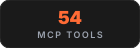

<p align="center">
  
</p>

<p align="center">
  <strong>
    Your coding agent remembers everything. No more re-explaining.
    Built on <a href="https://github.com/iii-hq/iii">iii engine</a>
  </strong><br/>
  Persistent memory for Claude Code, GitHub Copilot CLI, Cursor, Gemini CLI, Codex CLI, Hermes, OpenClaw, pi, OpenCode, and any MCP client.
</p>

<p align="center">
  <a href="README.md">English</a> |
  <a href="READMEs/README.zh-CN.md">简体中文</a> |
  <a href="READMEs/README.zh-TW.md">繁體中文</a> |
  <a href="READMEs/README.ja-JP.md">日本語</a> |
  <a href="READMEs/README.ko-KR.md">한국어</a> |
  <a href="READMEs/README.es-ES.md">Español</a> |
  <a href="READMEs/README.tr-TR.md">Türkçe</a> |
  <a href="READMEs/README.ru-RU.md">Русский</a> |
  <a href="READMEs/README.hi-IN.md">हिन्दी</a> |
  <a href="READMEs/README.pt-BR.md">Português</a> |
  <a href="READMEs/README.fr-FR.md">Français</a> |
  <a href="READMEs/README.de-DE.md">Deutsch</a>
</p>

<p align="center">
  <a href="https://trendshift.io/repositories/25123" target="_blank"></a>
</p>

<p align="center">
  <a href="https://gist.github.com/rohitg00/2067ab416f7bbe447c1977edaaa681e2"></a>
</p>

<p align="center">
  <em>The gist extends Karpathy's LLM Wiki pattern with confidence scoring, lifecycle, knowledge graphs, and hybrid search: agentmemory is the implementation.</em>
</p>

<p align="center">
  <a href="https://www.npmjs.com/package/@agentmemory/agentmemory"></a>
  <a href="https://github.com/safeblock-lab/agentmemory/actions"></a>
  <a href="https://github.com/safeblock-lab/agentmemory/blob/main/LICENSE"></a>
  <a href="https://github.com/safeblock-lab/agentmemory/stargazers"></a>
</p>

<p align="center">
  <picture><source media="(prefers-color-scheme: dark)" srcset="assets/tags/light/stat-recall.svg"></picture>
  <picture><source media="(prefers-color-scheme: dark)" srcset="assets/tags/light/stat-tokens.svg"></picture>
  <picture><source media="(prefers-color-scheme: dark)" srcset="assets/tags/light/stat-tools.svg"></picture>
  <picture><source media="(prefers-color-scheme: dark)" srcset="assets/tags/light/stat-hooks.svg"></picture>
  <picture><source media="(prefers-color-scheme: dark)" srcset="assets/tags/light/stat-deps.svg"></picture>
  <picture><source media="(prefers-color-scheme: dark)" srcset="assets/tags/light/stat-tests.svg"></picture>
</p>

<p align="center">
  
</p>

<p align="center">
  <a href="#install">Install</a> &bull;
  <a href="#quick-start">Quick Start</a> &bull;
  <a href="#benchmarks">Benchmarks</a> &bull;
  <a href="#vs-competitors">vs Competitors</a> &bull;
  <a href="#works-with-every-agent">Agents</a> &bull;
  <a href="#how-it-works">How It Works</a> &bull;
  <a href="#mcp-server">MCP</a> &bull;
  <a href="#real-time-viewer">Viewer</a> &bull;
  <a href="#powered-by-iii">Powered by iii</a> &bull;
  <a href="#configuration">Config</a> &bull;
  <a href="#api">API</a>
</p>

---

## Install

Requirements:

- Node.js 20 or newer with npm and npx (`node -v`, `npm -v`, and `npx -v`).
- macOS/Linux automatic iii-engine installation also needs `curl`, a POSIX `sh`, and `tar`. Minimal images such as `node:20-slim` may not include them.
- Native Windows requires the pinned iii-engine v0.22.1 `iii.exe` to be installed manually. WSL2 or Docker Desktop are the other supported paths.

Install this fork from its matching [GitHub Release](https://github.com/safeblock-lab/agentmemory/releases). On Windows, download `Install-AgentMemory.ps1` and run:

```powershell
powershell.exe -NoProfile -ExecutionPolicy Bypass -File .\Install-AgentMemory.ps1 -Version v0.9.56
agentmemory
```

The first run is an interactive setup: pick the agents to wire (Claude Code, Cursor, Codex, Gemini CLI, OpenCode, ...), pick an LLM provider or stay keyless, and it seeds the config, starts the memory server and its pinned iii engine, and offers to install globally so the bare `agentmemory` command works everywhere afterward. A provider makes LLM features available, but LLM-written observation compression starts only when `AGENTMEMORY_AUTO_COMPRESS=true` is also set.

Keyless mode disables vector embeddings. `memory_recall` (the `mem::search` path) uses BM25, while `memory_smart_search` can also fuse structural graph matches when graph data already exists. For free on-device semantic recall, set `EMBEDDING_PROVIDER=local` in `~/.agentmemory/.env` and restart. The first embedding request downloads `Xenova/all-MiniLM-L6-v2`; inference runs locally after that initial model download.

The local runtime uses four ports: `3111` for REST/MCP HTTP, `3112` for iii streams, `3113` for the viewer, and `49134` for the iii worker WebSocket. Persistent iii state lives in `~/Library/Application Support/agentmemory` on macOS, `$XDG_DATA_HOME/agentmemory` or `~/.local/share/agentmemory` on Linux, and `%APPDATA%\agentmemory` on Windows. Use `--data-dir <path>` or `AGENTMEMORY_DATA_DIR` to override it, and reuse the same value on every restart. For backward compatibility, an existing `./data/state_store.db` or `./data/iii-config.yaml` takes precedence over the platform default for instance 0; an explicit flag or environment override still wins.

Then prove recall works and give your agent its skills:

```bash
agentmemory demo  # seed sample sessions + exercise recall
npx skills add safeblock-lab/agentmemory -y   # 17 native skills so your agent knows when to reach for memory
```

The keyword searches should hit in default keyless mode through BM25. The demo's `database performance optimization` query is intentionally semantic and can return zero until an embedding provider is configured.

Prefer to let a coding agent do the whole thing? Hand it one instruction:

> For this internal fork, follow the [fork usage guide](docs/fork-local-usage.md).

Wire more agents any time with `agentmemory connect <agent>` — 20 adapters listed at [Works with every agent](#works-with-every-agent). Full command reference at [Quick Start](#quick-start).

<details>
<summary><strong>Windows</strong></summary>

The fast path is WSL2. Native Windows engine setup requires the pinned v0.22.1 ZIP to be downloaded and `iii.exe` extracted manually; the CLI does not auto-extract it. Docker Desktop is also supported. See the [Windows notes](#windows) for the step-by-step.

</details>

<details>
<summary><strong>Global install / EACCES</strong></summary>

```powershell
# Download Install-AgentMemory.ps1 from a GitHub Release.
# Omit -Version to install the latest stable release.
powershell.exe -NoProfile -ExecutionPolicy Bypass -File .\Install-AgentMemory.ps1
# Or install a specific release:
# powershell.exe -NoProfile -ExecutionPolicy Bypass -File .\Install-AgentMemory.ps1 -Version v0.9.56
agentmemory
```

Then, inside Codex or Claude Code:

```text
/plugin marketplace add safeblock-lab/agentmemory
/plugin install agentmemory
```

The plugin installs skills and hooks and launches MCP through the locally installed `agentmemory mcp` command. This global install replaces any existing global `@agentmemory/agentmemory` installation.

Already running your own `iii` engine? agentmemory pins iii-engine v0.22.1 and won't attach to a different version (the worker can't speak another engine's protocol). Stop the other engine, then run the installed `agentmemory` command.

</details>

<details>
<summary><strong>Already running your own iii engine</strong></summary>

agentmemory pins iii-engine v0.22.1 and won't attach to a different version (the worker can't speak another engine's protocol). Stop the other engine, then run `agentmemory`. It installs and runs the pinned v0.22.1 in `~/.agentmemory/bin`, leaving your own `iii` untouched.

</details>

---

<h2 id="works-with-every-agent"><picture><source media="(prefers-color-scheme: dark)" srcset="assets/tags/light/section-agents.svg"></picture></h2>

agentmemory works with any agent that supports hooks, MCP, or REST API. All agents share the same memory server.

<table>
<tr>
<td align="center" width="12.5%">
<a href="https://claude.com/product/claude-code"></a><br/>
<strong>Claude Code</strong><br/>
<sub>native plugin + 12 hooks + MCP</sub>
</td>
<td align="center" width="12.5%">
<a href="https://github.com/openai/codex"></a><br/>
<strong>Codex CLI</strong><br/>
<sub>native plugin + 6 hooks + MCP</sub>
</td>
<td align="center" width="12.5%">
<a href="https://github.com/features/copilot"></a><br/>
<strong>GitHub Copilot CLI</strong><br/>
<sub>MCP + plugin hooks/skills</sub>
</td>
<td align="center" width="12.5%">
<a href="integrations/openclaw/"></a><br/>
<strong>OpenClaw</strong><br/>
<sub>native plugin + MCP</sub>
</td>
<td align="center" width="12.5%">
<a href="integrations/hermes/"></a><br/>
<strong>Hermes</strong><br/>
<sub>native plugin + MCP</sub>
</td>
<td align="center" width="12.5%">
<a href="integrations/pi/"></a><br/>
<strong>pi</strong><br/>
<sub>native plugin + MCP</sub>
</td>
<td align="center" width="12.5%">
<a href="https://github.com/tinyhumansai/openhuman"></a><br/>
<strong>OpenHuman</strong><br/>
<sub>native Memory trait backend</sub>
</td>
<td align="center" width="12.5%">
<a href="https://cursor.com"><picture><source media="(prefers-color-scheme: dark)" srcset="https://svgl.app/library/cursor_dark.svg"></picture></a><br/>
<strong>Cursor</strong><br/>
<sub>native plugin + MCP</sub>
</td>
<td align="center" width="12.5%">
<a href="https://github.com/google-gemini/gemini-cli"></a><br/>
<strong>Gemini CLI</strong><br/>
<sub>MCP server</sub>
</td>
</tr>
<tr>
<td align="center" width="12.5%">
<a href="https://github.com/opencode-ai/opencode"><picture><source media="(prefers-color-scheme: dark)" srcset="https://svgl.app/library/opencode-dark.svg"></picture></a><br/>
<strong>OpenCode</strong><br/>
<sub>22 hooks + MCP + plugin</sub>
</td>
<td align="center" width="12.5%">
<a href="https://github.com/cline/cline"></a><br/>
<strong>Cline</strong><br/>
<sub>MCP server</sub>
</td>
<td align="center" width="12.5%">
<a href="https://github.com/block/goose"></a><br/>
<strong>Goose</strong><br/>
<sub>MCP server</sub>
</td>
<td align="center" width="12.5%">
<a href="https://github.com/Kilo-Org/kilocode"></a><br/>
<strong>Kilo Code</strong><br/>
<sub>MCP server</sub>
</td>
<td align="center" width="12.5%">
<a href="https://github.com/Aider-AI/aider"></a><br/>
<strong>Aider</strong><br/>
<sub>REST API</sub>
</td>
<td align="center" width="12.5%">
<a href="https://claude.ai/download"></a><br/>
<strong>Claude Desktop</strong><br/>
<sub>MCP server</sub>
</td>
<td align="center" width="12.5%">
<a href="https://devin.ai"></a><br/>
<strong>Devin</strong><br/>
<sub>6 hooks + MCP</sub>
</td>
<td align="center" width="12.5%">
<a href="https://github.com/RooCodeInc/Roo-Code"></a><br/>
<strong>Roo Code</strong><br/>
<sub>MCP server</sub>
</td>
</tr>
<tr>
<td align="center" width="12.5%">
<a href="https://www.warp.dev"></a><br/>
<strong>Warp</strong><br/>
<sub>connect + MCP + skills</sub>
</td>
</tr>
</table>

<p align="center">
  <sub>Works with <strong>any</strong> agent that speaks MCP or HTTP. One server, memories shared across all of them.</sub>
</p>

---

You explain the same architecture every session. You re-discover the same bugs. You re-teach the same preferences. Built-in memory (CLAUDE.md, .cursorrules) caps out at 200 lines and goes stale. agentmemory fixes this. It silently captures what your agent does, compresses it into searchable memory, and injects the right context when the next session starts. One command. Works across agents.

**What changes:** Session 1 you set up JWT auth. Session 2 you ask for rate limiting. The agent already knows your auth uses jose middleware in `src/middleware/auth.ts`, your tests cover token validation, and you chose jose over jsonwebtoken for Edge compatibility, with no re-explaining and no copy-pasting.

```bash
agentmemory
```

By default, agentmemory stores iii-engine state outside the repository you start it from: `~/Library/Application Support/agentmemory` on macOS, `$XDG_DATA_HOME/agentmemory` or `~/.local/share/agentmemory` on Linux, and `%APPDATA%\agentmemory` on Windows. An existing legacy `./data/state_store.db` or `./data/iii-config.yaml` is reused for instance 0 before that platform default. To choose a location explicitly, pass `--data-dir <path>` or set `AGENTMEMORY_DATA_DIR`; either explicit setting takes precedence over legacy discovery:

```bash
agentmemory --data-dir ~/.agentmemory-projects/main
AGENTMEMORY_DATA_DIR=~/.agentmemory-projects/main agentmemory
```

Native and Docker launches use this same resolved host directory; Docker bind-mounts it at `/data`. `--instance 1` appends `instance-1` to the resolved directory and selects the separate default port quartet `3211/3212/3213/49234`.

Latest release notes: [CHANGELOG.md](CHANGELOG.md).

> **Internal fork:** See [fork usage](docs/fork-local-usage.md) for its GitHub Release and Windows installer steps.

---

<h2 id="benchmarks"><picture><source media="(prefers-color-scheme: dark)" srcset="assets/tags/light/section-benchmarks.svg"></picture></h2>

<table>
<tr>
<td width="50%">

### Retrieval Accuracy

**coding-agent-life-v1** (in-house corpus, sandbox-reproducible)

| Adapter | P@5 | R@5 | Top-5 hit rate | p50 latency |
|---|---|---|---|---|
| **agentmemory hybrid** | **0.240** | **1.000** | **15 / 15** | 14 ms |
| grep baseline | 0.227 | 0.967 | 15 / 15 | 0 ms |

100% top-5 hit rate at the **P@5 math ceiling** for this corpus (0.240, see scorecard). Hybrid retrieves every gold session; grep misses 1 of 2 gold on the multi-session temporal query. Lift is **recall + temporal**, not aggregate precision. This benchmark is small and gold-sparse; the larger LongMemEval-S below differentiates better. Full per-type breakdown + correction note: [`docs/benchmarks/2026-05-20-coding-agent-life-v1.md`](docs/benchmarks/2026-05-20-coding-agent-life-v1.md).

**LongMemEval-S** (ICLR 2025, 500 questions)

| System | R@5 | R@10 | MRR |
|---|---|---|---|
| **agentmemory** | **95.2%** | **98.6%** | **88.2%** |
| BM25-only fallback | 86.2% | 94.6% | 71.5% |

</td>
<td width="50%">

### Token Savings

| Approach | Tokens/yr | Cost/yr |
|---|---|---|
| Paste full context | 19.5M+ | Impossible (exceeds window) |
| LLM-summarized | ~650K | ~$500 |
| **agentmemory** | **~170K** | **~$10** |
| agentmemory + local embeddings | ~170K | **$0** |

</td>
</tr>
</table>

> Embedding model: `all-MiniLM-L6-v2` (local, free, no API key). Full reports: [`benchmark/LONGMEMEVAL.md`](benchmark/LONGMEMEVAL.md), [`benchmark/QUALITY.md`](benchmark/QUALITY.md), [`benchmark/SCALE.md`](benchmark/SCALE.md). Competitor comparison: [`benchmark/COMPARISON.md`](benchmark/COMPARISON.md) covering agentmemory vs mem0, Letta, Khoj, supermemory, TencentDB Agent Memory, MemPalace, Zep/Graphiti, Cognee, Hippo.

**Reproduce locally:** [`eval/README.md`](eval/README.md), an adapter-pluggable harness for LongMemEval `_s` (public 500-Q) + `coding-agent-life-v1` (in-house 15-session corpus). Grep / vector / agentmemory adapters score side-by-side, NDJSON output, published scorecards land in [`docs/benchmarks/`](docs/benchmarks/).

**Pairs with [codegraph](https://github.com/colbymchenry/codegraph), [Understand Anything](https://github.com/Lum1104/Understand-Anything), and [Graphify](https://github.com/safishamsi/graphify).** Code-graph indexing, multi-agent build pipelines, and broader knowledge graphs across docs / PDFs / images / videos. agentmemory remembers the work; those three projects light up the rest of the context layer. Recipes + question-routing table: [`docs/recipes/pairings.md`](docs/recipes/pairings.md).

---

<h2 id="vs-competitors"><picture><source media="(prefers-color-scheme: dark)" srcset="assets/tags/light/section-competitors.svg"></picture></h2>

<table>
<tr>
<th></th>
<th>agentmemory</th>
<th>mem0 (63K ⭐)</th>
<th>Letta / MemGPT (24K ⭐)</th>
<th>Khoj (36K ⭐)</th>
<th>supermemory (29K ⭐)</th>
<th>TencentDB Agent Memory (22K ⭐)</th>
<th>MemPalace (54K ⭐)</th>
<th>oracleagentmemory</th>
<th>Hippo</th>
<th>Built-in (CLAUDE.md)</th>
</tr>
<tr>
<td><strong>Type</strong></td>
<td>Memory engine + MCP server</td>
<td>Memory layer API</td>
<td>Full agent runtime</td>
<td>Personal AI</td>
<td>Memory API + app</td>
<td>Team memory hub (LLM proxy)</td>
<td>Vector memory (OSS)</td>
<td>Memory engine (Oracle DB)</td>
<td>Memory system</td>
<td>Static file</td>
</tr>
<tr>
<td><strong>Retrieval R@5</strong></td>
<td><strong>95.2%</strong></td>
<td>68.5% (LoCoMo)</td>
<td>83.2% (LoCoMo)</td>
<td>N/A</td>
<td>Self-reported</td>
<td>PersonaMem 76% (self-reported)</td>
<td>~96.6% (self-reported)</td>
<td>94.4% (self-reported)</td>
<td>N/A</td>
<td>N/A (grep)</td>
</tr>
<tr>
<td><strong>Auto-capture</strong></td>
<td>12 hooks (zero manual effort)</td>
<td>Manual <code>add()</code> calls</td>
<td>Agent self-edits</td>
<td>Manual</td>
<td>API-side extraction</td>
<td>Proxy interception (base-URL swap)</td>
<td>Manual</td>
<td>API extraction</td>
<td>Manual</td>
<td>Manual editing</td>
</tr>
<tr>
<td><strong>Search</strong></td>
<td>BM25 + Vector + Graph (RRF fusion)</td>
<td>Vector + Graph</td>
<td>Vector (archival)</td>
<td>Semantic</td>
<td>Vector + RAG</td>
<td>4 asset types (Chat / Skill / Wiki / CodeGraph)</td>
<td>Vector-only</td>
<td>Vector + semantic</td>
<td>Decay-weighted</td>
<td>Loads everything into context</td>
</tr>
<tr>
<td><strong>Multi-agent</strong></td>
<td>MCP + REST + leases + signals</td>
<td>API (no coordination)</td>
<td>Within Letta runtime only</td>
<td>No</td>
<td>No</td>
<td>Team roles + shared assets</td>
<td>No</td>
<td>Scoped only</td>
<td>Multi-agent shared</td>
<td>Per-agent files</td>
</tr>
<tr>
<td><strong>Framework lock-in</strong></td>
<td>None (any MCP client)</td>
<td>None</td>
<td>High (must use Letta)</td>
<td>Standalone</td>
<td>None</td>
<td>Proxy fronts every model call</td>
<td>None</td>
<td>Oracle Database</td>
<td>None</td>
<td>Per-agent format</td>
</tr>
<tr>
<td><strong>External deps</strong></td>
<td>None (SQLite + iii-engine)</td>
<td>Qdrant / pgvector</td>
<td>Postgres + vector DB</td>
<td>Multiple</td>
<td>Managed cloud</td>
<td>Docker stack (Core + Hub + Proxy)</td>
<td>Vector store</td>
<td>Oracle AI Database</td>
<td>None</td>
<td>None</td>
</tr>
<tr>
<td><strong>Memory lifecycle</strong></td>
<td>4-tier consolidation + decay + auto-forget</td>
<td>Passive extraction</td>
<td>Agent-managed</td>
<td>Manual</td>
<td>Auto-forget</td>
<td>Manual review; auto-routing in progress</td>
<td>None</td>
<td>Not stated</td>
<td>Decay + consolidation</td>
<td>Manual pruning</td>
</tr>
<tr>
<td><strong>Token efficiency</strong></td>
<td>~1,900 tokens/session ($10/yr)</td>
<td>Varies by integration</td>
<td>Core memory in context</td>
<td>Varies</td>
<td>Cloud pricing</td>
<td>Not stated</td>
<td>No token budget</td>
<td>LLM-backed (varies)</td>
<td>Varies</td>
<td>22K+ tokens at 240 obs</td>
</tr>
<tr>
<td><strong>Real-time viewer</strong></td>
<td>Yes (port 3113)</td>
<td>Cloud dashboard</td>
<td>Cloud dashboard</td>
<td>Web UI</td>
<td>Cloud dashboard</td>
<td>Hub web UI</td>
<td>No</td>
<td>No</td>
<td>No</td>
<td>No</td>
</tr>
<tr>
<td><strong>Self-hosted</strong></td>
<td>Yes (default)</td>
<td>Optional</td>
<td>Optional</td>
<td>Yes</td>
<td>No (cloud-only)</td>
<td>Yes (Docker)</td>
<td>Yes</td>
<td>Yes (Oracle DB)</td>
<td>Yes</td>
<td>Yes</td>
</tr>
</table>

<sub>Benchmark note: only agentmemory's R@5 is our own measured result (LongMemEval-S, reproducible from <a href="benchmark/COMPARISON.md"><code>benchmark/COMPARISON.md</code></a>). The mem0 and Letta figures are their published LoCoMo numbers (a different dataset); the MemPalace, supermemory, TencentDB (PersonaMem), and oracleagentmemory figures are vendor self-reported claims we have not independently reproduced (oracleagentmemory's run used GPT-5.5 against an Oracle AI Database). Shown side by side for ballpark only, not a head-to-head on identical data. Star counts are approximate and drift over time.</sub>

**Newer entrants** worth knowing, compared in depth in [`benchmark/COMPARISON.md`](benchmark/COMPARISON.md):

| System | ⭐ | Angle |
|--------|---|-------|
| Zep / Graphiti | 30K | Temporal knowledge graph; strongest published temporal-query results (LongMemEval 63.8%), but graph builds asynchronously so fresh facts can lag |
| Cognee | 30K | Document-to-knowledge-graph ingestion, Python-only, built for structured entity extraction rather than session capture |

None of these auto-capture from coding-agent hooks, ship a local-first viewer, or run keyless — the combination agentmemory is built around.

---

<h2 id="quick-start"><picture><source media="(prefers-color-scheme: dark)" srcset="assets/tags/light/section-quickstart.svg"></picture></h2>

Compatibility: this release targets `iii-sdk` 0.22.1 and pins iii-engine v0.22.1.

### Try it in 30 seconds

```bash
# Terminal 1: start the server
agentmemory

# Terminal 2: seed sample data and see recall in action
agentmemory demo
```

`demo` seeds 3 realistic sessions (JWT auth, N+1 query fix, rate limiting) and runs searches against them. Keyless installs disable vectors, so the `mem::search` keyword queries should hit through BM25 while `database performance optimization` can return zero. `smart-search` may additionally return structural graph matches when graph data exists. To make the semantic query find the N+1 fix through vectors, set `EMBEDDING_PROVIDER=local`, restart, and allow the first model download to finish.

Open `http://localhost:3113` to watch the memory build live.

### Install globally

Install this fork from its matching GitHub Release; do not use `npx` for the upstream package. On Windows, download `Install-AgentMemory.ps1` and run:

```powershell
# Omit -Version to install the latest stable release.
powershell.exe -NoProfile -ExecutionPolicy Bypass -File .\Install-AgentMemory.ps1
# Or pin the installation to a specific release:
# powershell.exe -NoProfile -ExecutionPolicy Bypass -File .\Install-AgentMemory.ps1 -Version v0.9.56
```

This replaces any existing global `@agentmemory/agentmemory` installation. Afterwards the normal command works everywhere:

```bash
agentmemory
agentmemory stop
agentmemory remove
agentmemory connect claude-code
agentmemory doctor
```

For a running native Windows global npm installation, set a random `AGENTMEMORY_UPDATE_SECRET` of at least 32 characters in `~/.agentmemory/.env` and restart AgentMemory. Then open the local viewer's **Health** tab and select **Check for update**. Enter the secret in the masked dialog; after it shows the current and latest stable GitHub Release versions, confirm **Install and restart**. The updater verifies the release checksum, preserves the instance's data directory and port, and reports progress while the service restarts. Other installation types show why the button is unavailable. See the [fork usage guide](docs/fork-local-usage.md#update-from-the-local-viewer) for recovery steps and the manual installer alternative.

### Validate a fresh install and restart persistence

With the server running, validate REST, health, the viewer, and the iii-backed runtime status:

```bash
curl -fsS http://localhost:3111/agentmemory/livez
curl -fsS http://localhost:3111/agentmemory/health
curl -fsS -o /dev/null http://localhost:3113/
agentmemory status
```

The startup ready panel accounts for all four ports: REST/MCP HTTP on 3111, iii streams on 3112, the viewer on 3113, and the iii worker WebSocket on 49134. `status` confirms agentmemory health and the active provider/embedding mode.

Health samples run every 30 seconds. With iii-sdk 0.22.1, `connectionState` reports `connected` when the engine worker-list probe succeeds and `disconnected` when it fails or exceeds its five-second timeout. The SDK does not expose connection-state events.

Save a probe and confirm it is searchable:

```bash
curl -fsS -X POST http://localhost:3111/agentmemory/remember \
  -H 'Content-Type: application/json' \
  -d '{"content":"agentmemory restart persistence probe","concepts":["install-check"]}'

curl -fsS -X POST http://localhost:3111/agentmemory/smart-search \
  -H 'Content-Type: application/json' \
  -d '{"query":"restart persistence probe","limit":5}'
```

Then run `agentmemory stop`, start the canonical command again in Terminal 1, wait for `/agentmemory/livez`, and repeat the search. The probe must still be returned. If you selected a custom `--data-dir`, pass the same directory on the restart.

### Everyday commands

Install and setup live in [Install](#install) above (the first run walks you through it). Day to day:

```bash
agentmemory                    # start the server
agentmemory stop               # stop it cleanly
agentmemory connect <agent>    # wire another agent
agentmemory doctor             # interactive diagnostics + fix prompts
agentmemory remove             # uninstall everything we created
```

### Session Replay

Every session agentmemory records is replayable. Open the viewer, pick the **Replay** tab, and scrub through the timeline: prompts, tool calls, tool results, and responses render as discrete events with play/pause, speed control (0.5x to 4x), and keyboard shortcuts (space to toggle, arrows to step).

To bring in older Claude Code JSONL transcripts:

```bash
# Import everything under the default ~/.claude/projects
agentmemory import-jsonl

# Or import a single file
agentmemory import-jsonl ~/.claude/projects/-my-project/abc123.jsonl
```

Imported sessions show up in the Replay picker alongside native ones. Under the hood each entry routes through the `mem::replay::load`, `mem::replay::sessions`, and `mem::replay::import-jsonl` iii functions, with no side-channel servers. Each imported transcript is indexed for search, stamped with origin channel `import`, and mined for a session crystal and lessons.

> **Heads-up if you rely on `import-jsonl` as your primary capture path:** Claude Code's `cleanupPeriodDays` (in `~/.claude/settings.json`, default **30**) auto-deletes JSONL transcripts older than that window from `~/.claude/projects/`. If you install agentmemory fresh on a months-old Claude Code history, anything older than 30 days is already gone before the first import. Either run `import-jsonl` on a cron, raise `cleanupPeriodDays` to something higher, or wire the auto-capture hooks (the default plugin install path) so each turn lands in agentmemory while the session is live and the JSONL cleanup stops mattering.

### Upgrade / Maintenance

Use the matching GitHub Release installer when you intentionally want to update your local runtime.

The native Windows viewer updater reports completion only after the iii engine, the expected API version, connected engine health, and the advertised viewer port respond. If any check fails, it attempts to restore the previous installation.

Warning: this command mutates the current workspace/runtime. It can update JavaScript dependencies and pull the pinned `iiidev/iii:0.22.1` Docker image. It never installs an unpinned or newer iii engine.

Implementation details live in `src/cli.ts` (see `runUpgrade` around the `src/cli.ts:544-595` region).

### Claude Code (one block, paste it)

```text
Install agentmemory: run `agentmemory` in a separate terminal to start the memory server. Then run `/plugin marketplace add safeblock-lab/agentmemory` and `/plugin install agentmemory` — the plugin registers all hooks and skills and auto-wires the local `agentmemory mcp` stdio server. Verify with `curl http://localhost:3111/agentmemory/health`. The real-time viewer is at http://localhost:3113.
```

#### Claude Code without the plugin install (MCP-standalone path)

If you wire agentmemory's MCP server through `~/.claude.json` directly instead of using `/plugin install`, Claude Code never resolves `${CLAUDE_PLUGIN_ROOT}` and you have to point hook scripts at absolute paths in `~/.claude/settings.json`. Those paths typically embed the agentmemory version (e.g. `~/.codex/plugins/cache/agentmemory/agentmemory/0.9.22/scripts/…`), so the next upgrade silently breaks every hook.

Workaround:

```bash
agentmemory connect claude-code --with-hooks
```

This merges the same hook commands into `~/.claude/settings.json` with absolute paths resolved to the bundled `plugin/` directory of the currently installed `@agentmemory/agentmemory` package. Re-run the command after upgrading agentmemory to refresh the paths. User entries in the same file are preserved; only previous agentmemory entries are replaced. Using the `/plugin install` path remains the recommended approach.
For remote or protected deployments, launch Claude Code with `AGENTMEMORY_URL` and `AGENTMEMORY_SECRET` set. The plugin passes both values through to its bundled MCP server; when `AGENTMEMORY_URL` is empty, the MCP shim uses `http://localhost:3111`.

### Codex CLI (Codex plugin platform)

```bash
# 1. start the memory server in a separate terminal
agentmemory

# 2. register the agentmemory marketplace and install the plugin
codex plugin marketplace add safeblock-lab/agentmemory
codex plugin add agentmemory
```

The Codex plugin ships from the same `plugin/` directory as the Claude Code plugin. It registers:

- `agentmemory mcp` as an MCP server (proxies all 54 tools when `AGENTMEMORY_URL` points at a running agentmemory server; falls back to 7 tools locally when no server is reachable)
- 6 lifecycle hooks: `SessionStart`, `UserPromptSubmit`, `PreToolUse`, `PostToolUse`, `PreCompact`, `Stop`
- 9 invocable skills: `/recall`, `/remember`, `/session-history`, `/forget`, `/recap`, `/handoff`, `/lesson`, `/commit-context`, `/commit-history`, plus 8 reference skills the agent loads on demand (memory discipline, MCP tools, REST API, config, agents, hooks, architecture, and the skill-authoring guide)

Codex's hook engine injects `CLAUDE_PLUGIN_ROOT` into hook subprocesses (per [`codex-rs/hooks/src/engine/discovery.rs`](https://github.com/openai/codex/blob/main/codex-rs/hooks/src/engine/discovery.rs)), so the same hook scripts work across both hosts without duplication. Subagent / SessionEnd / Notification / TaskCompleted / PostToolUseFailure events are Claude-Code-only and are not registered for Codex.

#### Codex Desktop: plugin hooks currently silent (workaround available)

`CodexHooks` and `PluginHooks` are both stable + default-enabled in [`codex-rs/features/src/lib.rs`](https://github.com/openai/codex/blob/main/codex-rs/features/src/lib.rs), but Codex Desktop builds currently do not dispatch plugin-local `hooks.json` ([openai/codex#16430](https://github.com/openai/codex/issues/16430)). MCP tools still work; only the lifecycle observations are missing.

Until upstream lands the fix, mirror the same hook commands into the global `~/.codex/hooks.json`:

```bash
agentmemory connect codex --with-hooks
```

This adds an idempotent block to `~/.codex/hooks.json` referencing absolute paths to the bundled scripts (no `${CLAUDE_PLUGIN_ROOT}` expansion needed at user-scope). Re-run the same command after upgrading agentmemory to refresh paths. User entries in the same file are preserved; only previous agentmemory entries are replaced.

### GitHub Copilot CLI

```bash
# MCP-only wiring
agentmemory connect copilot-cli

# Full hooks/skills plugin from the GitHub subdir
copilot plugin install safeblock-lab/agentmemory:plugin
```

`agentmemory connect copilot-cli` merges `mcpServers.agentmemory` into `~/.copilot/mcp-config.json` (or `$COPILOT_HOME/mcp-config.json` when `COPILOT_HOME` is set) and preserves existing servers. On native Windows this is the only automated `connect` adapter; configure every other native Windows agent manually. WSL `connect` is supported only when the target agent is installed in that same WSL environment. Copilot picks up the MCP server on next launch or after `/mcp`. Install the plugin as well when you want the full hook/skill experience.

<details>
<summary><b>OpenClaw (paste this prompt)</b></summary>

```text
Install agentmemory for OpenClaw. Run `agentmemory` in a separate terminal to start the memory server on localhost:3111. Then add this to my OpenClaw MCP config so agentmemory is available with all 54 memory tools:

{
  "mcpServers": {
    "agentmemory": {
      "command": "agentmemory",
      "args": ["mcp"],
      "env": {
        "AGENTMEMORY_URL": "http://localhost:3111"
      }
    }
  }
}

Restart OpenClaw. Verify with `curl http://localhost:3111/agentmemory/health`. Open http://localhost:3113 for the real-time viewer. For deeper memory-slot integration, copy `integrations/openclaw` to `~/.openclaw/extensions/agentmemory` and enable `plugins.slots.memory = "agentmemory"` in `~/.openclaw/openclaw.json`.
```

Full guide: [`integrations/openclaw/`](integrations/openclaw/)

</details>

<details>
<summary><b>Hermes Agent (paste this prompt)</b></summary>

```text
Install agentmemory for Hermes. Run `agentmemory` in a separate terminal to start the memory server on localhost:3111. Then add this to ~/.hermes/config.yaml so Hermes can use agentmemory as an MCP server with all 54 memory tools:

mcp_servers:
  agentmemory:
    command: agentmemory
    args: ["mcp"]

memory:
  provider: agentmemory

Verify with `curl http://localhost:3111/agentmemory/health`. Open http://localhost:3113 for the real-time viewer. For deeper 6-hook memory provider integration (pre-LLM context injection, turn capture, MEMORY.md mirroring, system prompt block), copy integrations/hermes from the agentmemory repo to ~/.hermes/plugins/agentmemory.
```

Full guide: [`integrations/hermes/`](integrations/hermes/)

</details>

### Other agents

Start the memory server: `agentmemory`

#### Native skills via `npx skills add` (50+ agents)

agentmemory ships 17 skills in the Claude-Code-style `<dir>/SKILL.md` format: 9 invocable action skills (`remember`, `recall`, `recap`, `handoff`, `forget`, `lesson`, `commit-context`, `commit-history`, `session-history`) and 8 reference skills the agent loads on demand (`memory-discipline`, `agentmemory-mcp-tools`, `agentmemory-rest-api`, `agentmemory-config`, `agentmemory-agents`, `agentmemory-hooks`, `agentmemory-architecture`, `write-agentmemory-skill`). The reference skills carry data tables generated from source, so they never drift. The [`skills`](https://npmjs.com/package/skills) CLI by vercel-labs auto-installs them into the calling agent's native skill directory across 50+ agents (Claude Code, Cursor, Cline, Continue, Droid, Warp, Codex, Antigravity, Kiro, OpenCode, Goose, Roo, Trae, Windsurf, and more):

```bash
npx skills add safeblock-lab/agentmemory -y          # auto-detects the calling agent
npx skills add safeblock-lab/agentmemory -y -a warp  # explicit agent
npx skills add safeblock-lab/agentmemory -y -a '*'   # install to every installed agent
```

This is **complementary** to `agentmemory connect <agent>`:

- `agentmemory connect <agent>` writes the MCP server config so the tools are available.
- `npx skills add safeblock-lab/agentmemory` installs the skills so the agent knows when to call them.

For the few agents the skills CLI doesn't cover yet (Zed v1.3.x and below), drop the 17 SKILL.md files under the agent's native skill directory yourself; the same format works everywhere.

#### Standard MCP block

The agentmemory entry is the **same MCP server block** across every host that uses the `mcpServers` shape (Cursor, Claude Desktop, Cline, Roo Code, Gemini CLI, OpenClaw):

```json
"agentmemory": {
  "command": "agentmemory",
  "args": ["mcp"],
  "env": {
    "AGENTMEMORY_URL": "${AGENTMEMORY_URL}",
    "AGENTMEMORY_SECRET": "${AGENTMEMORY_SECRET}"
  }
}
```

**Merge this entry into the existing `mcpServers` object** in the host's config file; don't replace the file. If the file already has other servers, add `agentmemory` next to them as another key inside `mcpServers`. If `mcpServers` is missing entirely, paste the block inside `{ "mcpServers": { ... } }`. The `${VAR}` placeholders inherit `AGENTMEMORY_URL` / `AGENTMEMORY_SECRET` from the shell at MCP-server launch; unset vars pass empty strings and the shim falls back to `http://localhost:3111`. One wired entry covers both local and remote (k8s / reverse-proxied) deployments.

| Agent | Config file | Notes |
|---|---|---|
| **Cursor (MCP only)** | `~/.cursor/mcp.json` | Merge into `mcpServers`, or `agentmemory connect cursor`. One-click deeplink also available on the website. |
| **Cursor (full plugin)** | `.cursor-plugin/` | Cursor Marketplace listing (submission in review) or Cursor Settings → Plugins → local checkout. Registers 7 auto-capture hooks (sessionStart, beforeSubmitPrompt, preToolUse, postToolUse, postToolUseFailure, stop, sessionEnd) + 17 skills + the MCP server, with `AGENTMEMORY_URL` / `AGENTMEMORY_SECRET` managed in Cursor's plugin dashboard. Works in the Cursor IDE and `cursor-agent` CLI; CLI print-mode prompts are backfilled from the session transcript at session end. |
| **Claude Desktop** | `claude_desktop_config.json` (Application Support) | Merge into `mcpServers`. Restart Claude Desktop after editing. |
| **Cline / Roo Code / Kilo Code** | Cline MCP settings (Settings UI → MCP Servers → Edit) | Same `mcpServers` block. |
| **Windsurf** | `~/.codeium/windsurf/mcp_config.json` | Same `mcpServers` block. |
| **Gemini CLI** | `~/.gemini/settings.json` | `gemini mcp add agentmemory agentmemory mcp --scope user` (auto-merges). |
| **GitHub Copilot CLI (MCP only)** | `~/.copilot/mcp-config.json` | `agentmemory connect copilot-cli` merges `mcpServers.agentmemory`; Copilot picks it up on next launch or `/mcp`. |
| **GitHub Copilot CLI (full plugin)** | Copilot plugin install | `copilot plugin install safeblock-lab/agentmemory:plugin` for the plugin from the GitHub subdir. |
| **OpenClaw** | OpenClaw MCP config | Same `mcpServers` block, or use the deeper [memory plugin](integrations/openclaw/). |
| **Codex CLI (MCP only)** | `.codex/config.toml` | TOML shape: `codex mcp add agentmemory -- agentmemory mcp`, or add `[mcp_servers.agentmemory]` manually. |
| **Codex CLI (full plugin)** | Codex plugin marketplace | `codex plugin marketplace add safeblock-lab/agentmemory` then `codex plugin add agentmemory`. Registers MCP + hooks and skills. |
| **OpenCode (MCP only)** | `opencode.json` | Different shape — top-level `mcp` key, command as array: `{"mcp": {"agentmemory": {"type": "local", "command": ["agentmemory", "mcp"], "enabled": true}}}`. |
| **OpenCode (full plugin)** | `plugin/opencode/` | 22 auto-capture hooks covering session lifecycle, messages, tools, errors. Two slash commands (`/recall`, `/remember`). Copy `plugin/opencode/` into your OpenCode workspace and add the plugin entry to `opencode.json`. See [`plugin/opencode/README.md`](plugin/opencode/README.md) for the full hook table + gap analysis. |
| **pi** | `~/.pi/agent/extensions/agentmemory` | Copy [`integrations/pi`](integrations/pi/) and restart pi. |
| **Hermes Agent** | `~/.hermes/config.yaml` | Use the deeper [memory provider plugin](integrations/hermes/) with `memory.provider: agentmemory`. |
| **Qwen Code** | `~/.qwen/settings.json` | `agentmemory connect qwen` writes the standard `mcpServers` block. Hook payload is field-compatible with Claude Code, so the existing 12-hook scripts work without modification — wire them via the `hooks` section in the same `settings.json`. |
| **Devin CLI (MCP + hooks)** | `~/.config/devin/config.json` | `agentmemory connect devin` merges the MCP entry; `--with-hooks` adds six native auto-capture hooks (SessionStart, UserPromptSubmit, PreToolUse, PostToolUse, Stop, SessionEnd) with Devin'"'"'s lowercase tool matchers. Verify with `devin mcp list` and `/hooks` inside devin. |
| **Devin CLI (full plugin)** | `plugin/.devin-plugin/` | `devin plugins install ./plugin` from a checkout registers all 17 skills as `/agentmemory:<skill>` slash commands plus the MCP server. Devin plugin hooks cannot fire `SessionStart`/`SessionEnd`, so pair it with `connect devin --with-hooks` for full session capture. |
| **Devin (cloud)** | Settings → Connections → MCP servers | Add a custom MCP (STDIO): command `npx`, args `-y @agentmemory/mcp@latest`, env `AGENTMEMORY_URL` pointing at a network-reachable agentmemory deployment plus `AGENTMEMORY_SECRET` (cloud sessions cannot reach localhost — see [`deploy/`](deploy/)). Store the secret in Devin Secrets, then use "Test listing tools" to verify all 54 tools appear. |
| **Antigravity** (replaces Gemini CLI) | `mcp_config.json` (in Antigravity's User dir) | `agentmemory connect antigravity` writes the standard `mcpServers` block. macOS: `~/Library/Application Support/Antigravity/User/`. Linux: `~/.config/Antigravity/User/`. Use after the 2026-06-18 Gemini CLI sunset. |
| **Antigravity CLI** (`agy`) | `~/.gemini/config/mcp_config.json` | `agentmemory connect antigravity-cli`. The `agy` CLI keeps its own config under `~/.gemini/`, separate from the Antigravity IDE above. Pass `--with-hooks` for native auto-capture via `~/.gemini/config/hooks.json`. |
| **Kiro** | `~/.kiro/settings/mcp.json` | `agentmemory connect kiro` writes the user-level config. Workspace overrides go in `.kiro/settings/mcp.json` next to your code. |
| **Warp** | `~/.warp/.mcp.json` | `agentmemory connect warp` writes the standard `mcpServers` block. Warp also auto-discovers skills from `.claude/skills/`; once the Claude Code plugin is installed the 8 agentmemory skills (`remember`, `recall`, `recap`, `handoff`, `forget`, `commit-context`, `commit-history`, `session-history`) appear natively in Warp's slash-command palette. |
| **Cline (CLI)** | `~/.cline/mcp.json` | `agentmemory connect cline` writes the standard `mcpServers` block. VS Code extension users: paste the same block via Cline Settings → MCP Servers → Edit JSON. |
| **Continue.dev** | `~/.continue/config.yaml` (preferred) or `config.json` (legacy) | `agentmemory connect continue` creates `config.yaml` from scratch when neither exists, or modifies existing `config.json`. **If you already have `config.yaml`** the adapter prints the exact block to paste under `mcpServers:`; it won't silently rewrite your yaml because preserving comments and anchors safely needs a YAML parser the package doesn't ship. Continue uses array form (not object) for `mcpServers`. |
| **Zed** | `~/.config/zed/settings.json` | `agentmemory connect zed` writes under `context_servers` (Zed's key, NOT `mcpServers`). Remote MCP servers can be wired via `{"url": "..."}` instead. |
| **Droid (Factory.ai)** | `~/.factory/mcp.json` | `agentmemory connect droid` writes the standard `mcpServers` block. Project-scoped overrides go in `<repo>/.factory/mcp.json`. Pass `--with-hooks` for native auto-capture. |
| **DeepSeek Harness** | `$DSH_HOME/cordis.patch.yml` | `agentmemory connect dsh` appends an `@deepseek-ai/dsh-mcp-client` row to the home-level patch layer every Harness profile loads; tools register as `mcp__agentmemory__*`. Pass `--with-hooks` to also wire auto-capture: the bundled Claude Code hook scripts run through Harness's first-party `@deepseek-ai/dsh-hooks-claude-code` bridge (SessionStart, UserPromptSubmit, PreToolUse, PostToolUse, Stop) via a manifest written to `$DSH_HOME/agentmemory.hooks.json`. Defaults to `~/.dsh` when `DSH_HOME` is unset. |
| **Goose** | Goose MCP settings UI | Same `mcpServers` block; use `goose configure` → Add Extension → MCP. Direct YAML edit at `~/.config/goose/config.yaml` is supported but the schema uses `extensions:` + `cmd` (not `mcpServers:` + `command`). |
| **Aider** | n/a | Talk to the REST API directly: `curl -X POST http://localhost:3111/agentmemory/smart-search -d '{"query": "auth"}'`. |
| **Any agent (32+)** | n/a | `npx skillkit install agentmemory` auto-detects the host and merges. |

**Sandboxed MCP clients** (Flatpak / Snap / restrictive containers) that can't reach the host's `localhost`: also set `"AGENTMEMORY_FORCE_PROXY": "1"` in the `env` block, and point `AGENTMEMORY_URL` at a route the sandbox can actually reach (e.g. your LAN IP).

### Programmatic access (Python / Rust / Node)

agentmemory registers its core operations as iii functions (`mem::remember`, `mem::observe`, `mem::context`, `mem::smart-search`, `mem::forget`). Any language with an iii SDK can call them directly over `ws://localhost:49134`, with no separate REST client per language.

```bash
pip install iii-sdk         # Python
cargo add iii-sdk           # Rust
npm  install iii-sdk        # Node
```

```python
from iii import register_worker

iii = register_worker("ws://localhost:49134")
iii.connect()

iii.trigger({
    "function_id": "mem::smart-search",
    "payload": {"project": "demo", "query": "how do tokens refresh"},
})
```

Worked example: [`examples/python/`](examples/python/) (quickstart + observation/recall flow). REST on `:3111` remains available for hosts without an iii runtime.

### From source

```bash
git clone https://github.com/safeblock-lab/agentmemory.git && cd agentmemory
npm install && npm run build && npm start
```

This starts agentmemory with a local `iii-engine` if the pinned binary is already installed, or uses Docker Compose when selected. REST, streams, and the viewer bind to `127.0.0.1` by default. The automatic macOS/Linux binary path requires `curl`, a POSIX `sh`, and `tar`.

Install `iii-engine` manually. **agentmemory currently pins `iii-engine` to `v0.22.1`**, the same release as its `iii-sdk` dependency; the worker speaks that engine's wire protocol, and 0.20.0 reorganized the SDK surface, so the two move together in agentmemory releases. Override with `AGENTMEMORY_III_VERSION=<version>` if you run your own engine and know it matches.

- **macOS arm64:** `mkdir -p ~/.local/bin && curl -fsSL https://github.com/iii-hq/iii/releases/download/iii/v0.22.1/iii-aarch64-apple-darwin.tar.gz | tar -xz -C ~/.local/bin && chmod +x ~/.local/bin/iii`
- **macOS x64:** swap `aarch64-apple-darwin` for `x86_64-apple-darwin`
- **Linux x64:** swap for `x86_64-unknown-linux-gnu`
- **Linux arm64:** swap for `aarch64-unknown-linux-gnu`
- **Windows:** download `iii-x86_64-pc-windows-msvc.zip` from [iii-hq/iii releases v0.22.1](https://github.com/iii-hq/iii/releases/tag/iii%2Fv0.22.1) and extract `iii.exe` to `%USERPROFILE%\.agentmemory\bin\iii.exe`

Or use Docker (the bundled `docker-compose.yml` pulls `iiidev/iii:0.22.1`). Full docs: [iii.dev/docs](https://iii.dev/docs).

### Windows

agentmemory runs on Windows 10/11, but the Node.js package alone isn't enough; you also need the pinned iii-engine v0.22.1 runtime as a background process. The CLI does not auto-extract the Windows ZIP, so native Windows users must install `iii.exe` manually, use WSL2, or choose Docker Desktop.

Native Windows automated MCP wiring supports only `agentmemory connect copilot-cli`. For Claude Code, Codex, Cursor, and every other native Windows agent, copy the manual MCP block from [Other agents](#other-agents) into that agent's Windows config. Running `connect` in WSL is appropriate only when the target agent is also installed in the same WSL environment; it does not edit a Windows-host agent's configuration.

**Option A: prebuilt Windows binary (recommended)**

```powershell
# 1. Open https://github.com/iii-hq/iii/releases/tag/iii%2Fv0.22.1 in your browser
#    (agentmemory pins the engine to the same release as its iii-sdk;
#     v0.22.1 is the current pair)
# 2. Download iii-x86_64-pc-windows-msvc.zip
#    (or iii-aarch64-pc-windows-msvc.zip if you're on an ARM machine)
# 3. Extract iii.exe to agentmemory's private engine directory:
New-Item -ItemType Directory -Force "$HOME\.agentmemory\bin"
# Copy iii.exe to $HOME\.agentmemory\bin\iii.exe
# 4. Verify:
& "$HOME\.agentmemory\bin\iii.exe" --version
# Should print: 0.22.1

# 5. Then run agentmemory as usual:
agentmemory
```

**Option B: Docker Desktop**

```powershell
# 1. Install Docker Desktop for Windows
# 2. Start Docker Desktop and make sure the engine is running
# 3. Select Docker explicitly and run agentmemory:
$env:AGENTMEMORY_USE_DOCKER = "1"
agentmemory
```

**Option C: standalone MCP only (no engine).** If you only need the MCP tools for your agent and don't need the REST API, viewer, or cron jobs, skip the engine entirely:

```powershell
agentmemory mcp
```

**Diagnostics for Windows:** if `agentmemory` fails, re-run with `--verbose` to see the actual engine stderr. Common failure modes:

| Symptom | Fix |
|---|---|
| `The engine process started but the REST API never responded.` | Confirm all four derived ports are free, verify the pinned `iii.exe` stayed alive, then re-run with `--verbose` and inspect the captured engine stderr |
| `Could not start iii-engine` | Neither `iii.exe` nor Docker is installed. See Option A or B above |
| Port conflict | `netstat -ano \| findstr :3111` to see what's bound, then kill it or use `--port <N>` |
| Docker fallback skipped even though Docker is installed | Make sure Docker Desktop is actually running (system tray icon) |

> Note: the iii **engine** is a prebuilt binary, not a cargo crate, so don't try to `cargo install` it. (The iii **SDKs** are published on crates.io, npm, and PyPI, but agentmemory doesn't need them.) Supported engine install methods are all pinned to v0.22.1: the prebuilt binary above, agentmemory's macOS/Linux auto-install path (`curl`, POSIX `sh`, and `tar` required), and the Docker image `iiidev/iii:0.22.1`. A bare upstream `install.sh | sh` installs the latest engine, which agentmemory does not support. Use `agentmemory`; on macOS/Linux it fetches the pinned engine into `~/.agentmemory/bin`.

---

<h2 id="deploy">Deploy</h2>

One-click templates for managed hosts. Each one ships a self-contained
Dockerfile that pulls `@agentmemory/agentmemory` from npm and copies
the iii engine binary in from the official `iiidev/iii` Docker Hub
image; no pre-built agentmemory image required. Persistent storage
mounts at `/data`; the first-boot entrypoint overwrites the
npm-bundled iii config (which binds `127.0.0.1`) with a deploy-tuned
one that binds `0.0.0.0` and uses absolute `/data` paths, generates
the HMAC secret, then drops privileges from `root` to `node` via
`gosu` before exec'ing the agentmemory CLI.

<p>
  <a href="https://fly.io/launch?repo=https://github.com/safeblock-lab/agentmemory&path=deploy/fly"></a>
  <a href="https://railway.com/new/template?template=https%3A%2F%2Fgithub.com%2Frohitg00%2Fagentmemory&rootDirectory=deploy%2Frailway"></a>
</p>

Render's one-click deploy button requires `render.yaml` at the repository root, which we deliberately keep clean. Use the Render Blueprint flow documented in [`deploy/render/`](./deploy/render/README.md) to point at the in-repo blueprint manually.

Full setup details (HMAC capture, viewer SSH tunnel, rotation, backup,
cost floors) live in [`deploy/`](./deploy/README.md):

- [`deploy/fly`](./deploy/fly/README.md): single machine with
  `auto_stop_machines = "stop"`; cheapest idle.
- [`deploy/railway`](./deploy/railway/README.md): Hobby plan flat fee,
  volume in the dashboard.
- [`deploy/render`](./deploy/render/README.md): Blueprint flow,
  automatic disk snapshots on paid plans.
- [`deploy/coolify`](./deploy/coolify/README.md): self-hosted on your
  own VPS via [Coolify](https://coolify.io/self-hosted); same Docker
  Compose stack, you own the host and the data.

Only port `3111` is published. The viewer on `3113` stays bound to
loopback inside the container; every template's README documents the
SSH-tunnel pattern for reaching it.

---

<h2 id="why-agentmemory"><picture><source media="(prefers-color-scheme: dark)" srcset="assets/tags/light/section-why.svg"></picture></h2>

Every coding agent forgets everything when the session ends, and each new session starts with you re-explaining your stack. agentmemory runs in the background and removes that step.

```text
Session 1: "Add auth to the API"
  Agent writes code, runs tests, fixes bugs
  agentmemory silently captures every tool use
  Session ends -> observations compressed into structured memory

Session 2: "Now add rate limiting"
  Agent already knows:
    - Auth uses JWT middleware in src/middleware/auth.ts
    - Tests in test/auth.test.ts cover token validation
    - You chose jose over jsonwebtoken for Edge compatibility
  Zero re-explaining. Starts working immediately.
```

### vs built-in agent memory

Every AI coding agent ships with built-in memory: Claude Code has `MEMORY.md`, Cursor has notepads, Cline has memory bank. These work like sticky notes. agentmemory is the searchable database behind the sticky notes.

| | Built-in (CLAUDE.md) | agentmemory |
|---|---|---|
| Scale | 200-line cap | Unlimited |
| Search | Loads everything into context | BM25 + vector + graph (top-K only) |
| Token cost | 22K+ at 240 observations | ~1,900 tokens (92% less) |
| Cross-agent | Per-agent files | MCP + REST (any agent) |
| Coordination | None | Leases, signals, actions, routines |
| Observability | Read files manually | Real-time viewer on :3113 |

---

<h2 id="how-it-works"><picture><source media="(prefers-color-scheme: dark)" srcset="assets/tags/light/section-how.svg"></picture></h2>

### Memory Pipeline

```text
PostToolUse hook fires
  -> SHA-256 dedup (5min window)
  -> Privacy filter (strip secrets, API keys)
  -> Store raw observation
  -> Synthetic compression by default
     (LLM-written compression only with a provider + AGENTMEMORY_AUTO_COMPRESS=true)
  -> Vector embedding when an embedding provider is active
  -> Index in BM25, plus vectors when enabled

Stop / SessionEnd hook fires
  -> Summarize session
  -> Knowledge graph extraction (if GRAPH_EXTRACTION_ENABLED=true)
  -> Slot reflection (if SLOT_REFLECT_ENABLED=true)

SessionStart hook fires
  -> Load project profile (top concepts, files, patterns)
  -> Hybrid search (BM25 + vector + graph)
  -> Token budget (default: 2000 tokens)
  -> Inject into conversation
```

### 4-Tier Memory Consolidation

Modeled on how human brains process memory, including sleep consolidation.

| Tier | What | Analogy |
|------|------|---------|
| **Working** | Raw observations from tool use | Short-term memory |
| **Episodic** | Compressed session summaries | "What happened" |
| **Semantic** | Extracted facts and patterns | "What I know" |
| **Procedural** | Workflows and decision patterns | "How to do it" |

Memories decay over time (Ebbinghaus curve). Frequently accessed memories strengthen. Stale memories auto-evict. Contradictions are detected and resolved.

### What Gets Captured

| Hook | Captures |
|------|----------|
| `SessionStart` | Project path, session ID |
| `UserPromptSubmit` | User prompts (privacy-filtered) |
| `PreToolUse` | File access patterns + enriched context |
| `PostToolUse` | Tool name, input, output |
| `PostToolUseFailure` | Error context |
| `PreCompact` | Re-injects memory before compaction |
| `SubagentStart/Stop` | Sub-agent lifecycle |
| `Stop` | End-of-session summary |
| `SessionEnd` | Session complete marker |

### Key Capabilities

| Capability | Description |
|---|---|
| **Automatic capture** | Every tool use recorded via hooks, no manual effort |
| **Semantic search** | BM25 + vector + knowledge graph with RRF fusion |
| **Memory evolution** | Versioning, supersession, relationship graphs |
| **Recall hygiene** | Superseded memory versions leave the search indexes; the version chain in KV keeps full history |
| **Near-duplicate hints** | Saves report an advisory `similarTo` match when new content closely resembles an existing memory |
| **Per-agent scoping** | `agentId` threads through save and recall across REST, MCP, and the search index, in shared or isolated mode |
| **Write-time provenance** | Every observation and memory carries an immutable origin channel (user, agent, tool, import, or shared) stamped at capture, save, and import |
| **Auto-forgetting** | TTL expiry, contradiction detection, importance eviction |
| **Privacy first** | API keys, secrets, `<private>` tags stripped before storage |
| **Self-healing** | Circuit breaker, provider fallback chain, health monitoring |
| **Claude bridge** | Bi-directional sync with MEMORY.md |
| **Knowledge graph** | Entity extraction + BFS traversal |
| **Team memory** | Namespaced shared + private across team members |
| **Citation provenance** | Trace any memory back to source observations |
| **Git snapshots** | Version, rollback, and diff memory state |

---

<h2 id="search"><picture><source media="(prefers-color-scheme: dark)" srcset="assets/tags/light/section-search.svg"></picture></h2>

Triple-stream retrieval combining three signals:

| Stream | What it does | When |
|---|---|---|
| **BM25** | Stemmed keyword matching with synonym expansion | Always on |
| **Vector** | Cosine similarity over dense embeddings | Embedding provider configured |
| **Graph** | Knowledge graph traversal via entity matching | Entities detected in query |

Fused with Reciprocal Rank Fusion (RRF, k=60) and session-diversified (max 3 results per session).

When a vector index is populated, `mem::search` (behind `memory_recall`) uses the hybrid BM25 + vector ranker. Without embeddings it uses BM25. `smart-search` can additionally fuse structural graph matches when graph data exists, including in keyless mode. Lesson recall runs on a dedicated in-memory BM25 index instead of scanning the whole corpus per query. Superseded memory versions are excluded from every recall path; the version chain keeps their history.

BM25 tokenizes Greek, Cyrillic, Hebrew, Arabic, and accented Latin out of the box. For Chinese / Japanese / Korean memories, install the optional segmenters (`npm install @node-rs/jieba tiny-segmenter`) to split CJK runs into word-level tokens; without them, agentmemory soft-falls to whole-run tokenization and prints a one-time hint on stderr.

### Embedding providers

Keyless installs disable vector embeddings: `mem::search` uses BM25, while `smart-search` can also use existing structural graph data. To opt into free on-device semantic embeddings, add this to `~/.agentmemory/.env` and restart agentmemory:

```env
EMBEDDING_PROVIDER=local
```

The normal npm install includes the optional `@huggingface/transformers` runtime. The first embedding request downloads `Xenova/all-MiniLM-L6-v2`, so it needs network access and can take longer; subsequent inference runs on-device. Remote providers are auto-detected from their keys unless `EMBEDDING_PROVIDER` overrides them.

| Provider | Model | Cost | Notes |
|---|---|---|---|
| **Local (recommended opt-in)** | `all-MiniLM-L6-v2` | Free | On-device after the first model download, +8pp recall over BM25-only |
| Gemini | `gemini-embedding-001` | Free tier | 100+ languages, 768/1536/3072 dims (MRL), 2048-token input. Replaces `text-embedding-004` ([deprecated, shutdown Jan 14, 2026](https://ai.google.dev/gemini-api/docs/deprecations)) |
| OpenAI | `text-embedding-3-small` | $0.02/1M | Highest quality |
| Voyage AI | `voyage-code-3` | Paid | Optimized for code |
| Cohere | `embed-english-v3.0` | Free trial | General purpose |
| OpenRouter | Any model | Varies | Multi-model proxy |

---

<h2 id="mcp-server"><picture><source media="(prefers-color-scheme: dark)" srcset="assets/tags/light/section-mcp.svg"></picture></h2>

54 tools, 6 resources, 3 prompts, and 17 skills.

> **MCP server:** `agentmemory mcp` exposes the full tool surface when it can reach a running agentmemory server through `AGENTMEMORY_URL`. If you see only local tools in Cursor, OpenCode, or Gemini CLI, start `agentmemory` (or the Docker stack) and set `AGENTMEMORY_URL=http://localhost:3111`.

### 54 Tools

Three tool surfaces, smallest to largest: `AGENTMEMORY_TOOLS=core` trims visibility to 8 essentials (`memory_save`, `memory_recall`, `memory_consolidate`, `memory_smart_search`, `memory_sessions`, `memory_diagnose`, `memory_lesson_save`, `memory_reflect`); the base set below is the registry's 14 foundational tools; the default (`AGENTMEMORY_TOOLS=all`) exposes all 54.

<details>
<summary>Base tools (14)</summary>

| Tool | Description |
|------|-------------|
| `memory_recall` | Search past observations |
| `memory_compress_file` | Compress markdown files while preserving structure |
| `memory_save` | Save an insight, decision, or pattern |
| `memory_file_history` | Past observations about specific files |
| `memory_patterns` | Detect recurring patterns |
| `memory_sessions` | List recent sessions |
| `memory_smart_search` | Hybrid semantic + keyword search |
| `memory_vision_search` | Search image observations |
| `memory_timeline` | Chronological observations |
| `memory_profile` | Project profile (concepts, files, patterns) |
| `memory_export` | Export all memory data |
| `memory_relations` | Query relationship graph |
| `memory_commit_lookup` | Sessions behind a git commit |
| `memory_commits` | Commits recorded for a session |

</details>

<details>
<summary>Extended tools (54 total, the default surface)</summary>

| Tool | Description |
|------|-------------|
| `memory_patterns` | Detect recurring patterns |
| `memory_timeline` | Chronological observations |
| `memory_relations` | Query relationship graph |
| `memory_graph_query` | Knowledge graph traversal |
| `memory_consolidate` | Run 4-tier consolidation |
| `memory_claude_bridge_sync` | Sync with MEMORY.md |
| `memory_team_share` | Share with team members |
| `memory_team_feed` | Recent shared items |
| `memory_audit` | Audit trail of operations |
| `memory_governance_delete` | Delete with audit trail |
| `memory_snapshot_create` | Git-versioned snapshot |
| `memory_action_create` | Create work items with dependencies |
| `memory_action_update` | Update action status |
| `memory_frontier` | Unblocked actions ranked by priority |
| `memory_next` | Single most important next action |
| `memory_lease` | Exclusive action leases (multi-agent) |
| `memory_routine_run` | Instantiate workflow routines |
| `memory_signal_send` | Inter-agent messaging |
| `memory_signal_read` | Read messages with receipts |
| `memory_checkpoint` | External condition gates |
| `memory_mesh_sync` | P2P sync between instances |
| `memory_sentinel_create` | Event-driven watchers |
| `memory_sentinel_trigger` | Fire sentinels externally |
| `memory_sketch_create` | Ephemeral action graphs |
| `memory_sketch_promote` | Promote to permanent |
| `memory_crystallize` | Compact action chains |
| `memory_diagnose` | Health checks |
| `memory_heal` | Auto-fix stuck state |
| `memory_facet_tag` | Dimension:value tags |
| `memory_facet_query` | Query by facet tags |
| `memory_verify` | Trace provenance |

</details>

### 6 Resources · 3 Prompts · 17 Skills

| Type | Name | Description |
|------|------|-------------|
| Resource | `agentmemory://status` | Health, session count, memory count |
| Resource | `agentmemory://project/{name}/profile` | Per-project intelligence |
| Resource | `agentmemory://project/{name}/recent` | Recent observations for a project |
| Resource | `agentmemory://memories/latest` | Latest 10 active memories |
| Resource | `agentmemory://graph/stats` | Knowledge graph statistics |
| Resource | `agentmemory://team/{id}/profile` | Shared team profile |
| Prompt | `recall_context` | Search + return context messages |
| Prompt | `session_handoff` | Handoff data between agents |
| Prompt | `detect_patterns` | Analyze recurring patterns |
| Skill | `/recall` | Search memory |
| Skill | `/remember` | Save to long-term memory |
| Skill | `/session-history` | Recent session summaries |
| Skill | `/forget` | Delete observations/sessions |

The table shows the four core skills. The full set is 9 invocable skills plus 8 reference skills; see the Native skills section above.

### Standalone MCP

Run without the full server, for any MCP client. Either of these works:

```bash
agentmemory mcp
```

Or add to your agent's MCP config:

Most agents (Cursor, Claude Desktop, Cline, Roo Code, Gemini CLI):
```json
{
  "mcpServers": {
    "agentmemory": {
      "command": "agentmemory",
      "args": ["mcp"],
      "env": {
        "AGENTMEMORY_URL": "http://localhost:3111"
      }
    }
  }
}
```

Merge the `agentmemory` entry into your host's existing `mcpServers` object rather than replacing the file. For sandboxed clients that can't reach the host's `localhost`, add `"AGENTMEMORY_FORCE_PROXY": "1"` to the env block and set `AGENTMEMORY_URL` to a route the sandbox can reach.

OpenCode (`opencode.json`):
```json
{
  "mcp": {
    "agentmemory": {
      "type": "local",
      "command": ["agentmemory", "mcp"],
      "enabled": true
    }
  },
  "plugin": ["./plugins/agentmemory-capture.ts"]
}
```

Copy the plugin file from the repo:
```bash
mkdir -p ~/.config/opencode/plugins
cp plugin/opencode/agentmemory-capture.ts ~/.config/opencode/plugins/
cp plugin/opencode/commands/*.md ~/.config/opencode/commands/
```

---

<h2 id="real-time-viewer"><picture><source media="(prefers-color-scheme: dark)" srcset="assets/tags/light/section-viewer.svg"></picture></h2>

Auto-starts on port `3113`. Live observation stream with a stream status indicator, a two-pane session explorer (list beside a sticky detail panel on wide screens), memory and lesson rows that expand to the full stored record including raw JSON and origin provenance, a knowledge graph that clusters nodes by type while relations are sparse, session replay, and a health dashboard.

```bash
open http://localhost:3113
```

The viewer server binds to `127.0.0.1` by default. The REST-served `/agentmemory/viewer` endpoint follows the normal `AGENTMEMORY_SECRET` bearer-token rules. CSP headers use a per-response script nonce and disable inline handler attributes (`script-src-attr 'none'`).

---

<h2 id="iii-console"><picture><source media="(prefers-color-scheme: dark)" srcset="assets/tags/light/section-viewer.svg"></picture></h2>

The viewer at `:3113` shows what your agent **remembered**. The [iii console](https://iii.dev/docs/console) shows what your agent **did**: every memory op as an OpenTelemetry trace, every KV entry editable, every function invocable, every stream tappable. Two windows on the same memory: one product-shaped, one engine-shaped.

Watch a `memory_smart_search` fire and see the BM25 scan → embedding lookup → RRF fusion → reranker as a waterfall. Edit a stuck consolidation timer in the KV browser. Replay a `PostToolUse` hook with a tweaked payload. Pin the WebSocket stream and watch observations land live.

agentmemory ships this for free because every function call and trigger fires through iii; nothing custom, nothing to instrument.

<p align="center">
  
  <br/>
  <em>Workers page: every connected worker, including agentmemory itself, with PID, function count, runtime, and last-seen.</em>
</p>

**Already installed.** The console ships with the pinned `iii` engine (0.22+); nothing separate to install. The first launch downloads the console binary next to the engine.

**Launch alongside agentmemory:**

```bash
agentmemory console
```

This runs the pinned engine's `iii console` against the ports agentmemory resolved (REST, streams, bridge) and serves it one port above the viewer, `http://localhost:3114` by default. `--console-port N` picks another port; `--port` and `--instance` select the agentmemory instance the same way they do for `stop`; any other flag is passed through, for example `--enable-flow` for the experimental architecture-graph page.

The same thing by hand, useful when `agentmemory` is not on PATH:

```bash
~/.agentmemory/bin/iii console --port 3114 \
  --engine-port 3111 \
  --ws-port 3112 \
  --bridge-port 49134
```

**What you can do from the console:**

| Page | Use it to |
|------|-----------|
| **Workers** | See every connected worker and its live metrics, including the agentmemory worker itself. |
| **Functions** | Invoke any of agentmemory's functions directly with a JSON payload; handy for testing `memory.recall`, `memory.consolidate`, `graph.query` without wiring a client. |
| **Triggers** | Replay HTTP, cron, event, and state triggers: fire the consolidation cron manually, retry an HTTP route, emit a state change. |
| **States** | KV browser with full CRUD over sessions, memory slots, lifecycle timers, and the embeddings index; edit values in place. |
| **Streams** | Live WebSocket monitor for memory writes, hook events, and observation updates as they flow through iii streams. |
| **Queues** | Durable queue topics + dead-letter management. Replay or drop failed embedding / compression jobs. |
| **Traces** | OpenTelemetry waterfall / flame / service-breakdown views. Filter by `trace_id` to see exactly which functions, DB calls, and embedding requests a single `memory.search` produced. |
| **Logs** | Structured OTEL logs filtered and correlated to trace/span IDs. |
| **Config** | Runtime configuration: see exactly which workers, providers, and ports your engine is running with. |
| **Flow** | (Optional, `--enable-flow`) Interactive architecture graph of every worker, trigger, and stream. |

<p align="center">
  
  <br/>
  <em>Traces: waterfall / flame / service breakdown for every memory operation.</em>
</p>

**Traces are already on:**

`iii-config.yaml` ships with the `iii-observability` worker enabled (`exporter: memory`, `sampling_ratio: 0.1`, metrics + logs). No extra config needed; the moment agentmemory starts, every memory operation emits a structured log the console can read, and one in ten of them (`sampling_ratio: 0.1`) also emits a trace span.

If you want to export to Jaeger/Honeycomb/Grafana Tempo instead, change `exporter: memory` to `exporter: otlp` and set the collector endpoint per iii's observability docs.

> **Heads-up:** no auth is enforced on the console itself; keep it bound to `127.0.0.1` (the default) and never expose it publicly.

---

<h2 id="powered-by-iii"><picture><source media="(prefers-color-scheme: dark)" srcset="assets/tags/light/section-architecture.svg"></picture></h2>

agentmemory is **already a running [iii](https://iii.dev) instance**. Three primitives (worker, function, trigger) compose the runtime; KV state, streams, and OTEL traces come from iii-state, iii-stream, and iii-observability workers that ship with iii. You didn't install Postgres, Redis, Express, pm2, or Prometheus, because iii replaces them.

That means one more command extends agentmemory with an entire new capability.

### Extend agentmemory with more workers

The builtins agentmemory needs are already in `iii-config.yaml` and boot with it: `iii-state` (KV), `iii-queue` (durable retries for the event subscribers), `iii-pubsub`, `iii-cron`, `iii-stream`, and `iii-observability` (OTEL traces, metrics and logs on every function). Anything else from the [iii worker registry](https://workers.iii.dev) plugs into the same engine: copy `iii-config.yaml` to `~/.agentmemory/iii-config.yaml` (the CLI prefers that file over the bundled one and still renders ports and data paths into it), add the entry, install the worker runtime once with `~/.agentmemory/bin/iii update worker`, and restart agentmemory.

```yaml
workers:
  # ...the bundled entries...
  - name: database          # SQL-backed state adapter when you outgrow the KV defaults
  - name: iii-sandbox       # run code that came out of memory_recall inside a throwaway VM
  - name: mcp               # extra MCP servers next to agentmemory's, same engine
```

| Worker | What you get on top of agentmemory |
|---|---|
| [`database`](https://workers.iii.dev/workers/database) | SQL-backed state adapter when you outgrow the in-memory KV defaults |
| [`iii-sandbox`](https://workers.iii.dev/workers/iii-sandbox) | Code that came out of `memory_recall` runs inside a throwaway VM, not your shell |
| [`mcp`](https://workers.iii.dev/workers/mcp) | Stand up extra MCP servers next to agentmemory's, share the same engine |

On engine 0.22.x keep the `iii-` prefixed names for the builtins above; the unprefixed `http`, `state`, `queue`, `pubsub` and `cron` entries are the standalone registry workers agentmemory moves to with the 0.23 migration.

Full registry: [workers.iii.dev](https://workers.iii.dev). Every worker there composes through the same primitives agentmemory uses, and the agentmemory you already have is one of them.

### What iii replaces

| Traditional stack | agentmemory uses |
|---|---|
| Express.js / Fastify | iii HTTP Triggers |
| SQLite / Postgres + pgvector | iii KV State + in-memory vector index |
| SSE / Socket.io | iii Streams (WebSocket) |
| pm2 / systemd | iii engine worker supervision |
| Prometheus / Grafana | iii OTEL + health monitor |
| Custom plugin systems | `iii worker add <name>` |

**184 source files · ~42,200 LOC · 1,674 tests · 264 functions · 50 KV scopes**, all on three primitives. No `agentmemory plugin install`. The plugin system is iii itself.

---

<h2 id="configuration"><picture><source media="(prefers-color-scheme: dark)" srcset="assets/tags/light/section-config.svg"></picture></h2>

### LLM Providers

agentmemory auto-detects generation providers from your environment. By default, no generative LLM calls are made unless you configure a provider or explicitly opt in to the Claude subscription fallback. TypeSafe.ai typed decisions use a separate key and do not generate summaries or prose.
agentmemory auto-detects providers from your environment. A provider makes LLM-backed operations available, but provider configuration alone does not enable LLM-written observation compression. That path requires both a provider and `AGENTMEMORY_AUTO_COMPRESS=true`.

| Provider | Config | Notes |
|----------|--------|-------|
| **No-op (default)** | No config needed | LLM-backed compress/summarize is disabled. Synthetic compression and BM25 recall still work. See `AGENTMEMORY_ALLOW_AGENT_SDK` below if you used to rely on the Claude-subscription fallback. |
| Anthropic API | `ANTHROPIC_API_KEY` | Per-token billing |
| MiniMax | `MINIMAX_API_KEY` | Anthropic-compatible |
| Gemini | `GEMINI_API_KEY` | Also enables embeddings |
| Gemini account pool | `AGENTMEMORY_GEMINI_ACCOUNTS_DIR` | Serializes Google calls at one request per second, tries one project/account JSON at a time on HTTP 429, then samples two free OpenRouter accounts before Fireworks. |
| OpenRouter | `OPENROUTER_API_KEY` | Any model |
| OpenAI API | `OPENAI_API_KEY` | Default `gpt-5.6-luna`, override with `OPENAI_MODEL` |
| Fireworks.ai | `OPENAI_API_KEY` + `OPENAI_BASE_URL` | OpenAI-compatible chat API; set `OPENAI_MODEL` and optionally `OPENAI_REASONING_EFFORT`. See [Fireworks.ai (OpenAI-compatible)](#fireworksai-openai-compatible). |
| TypeSafe.ai decisions | `TYPESAFE_API_KEY` | Typed decisions for eligible observations and automatic analysis, independent of the generation provider. Switches default to enabled. See [TypeSafe.ai decisions](docs/typesafe.md). |
| **Local (Ollama / LM Studio / vLLM / llama.cpp)** | `OPENAI_API_KEY=local` + `OPENAI_BASE_URL=http://localhost:11434/v1` (Ollama) or `http://localhost:1234/v1` (LM Studio) + `OPENAI_MODEL=<your model>` | Anything OpenAI-API-compatible. Zero cost, runs on your hardware. See [Local models](#local-models-ollama-lm-studio-vllm) below. |
| Claude subscription fallback | `AGENTMEMORY_ALLOW_AGENT_SDK=true` | Opt-in only. Spawns `@anthropic-ai/claude-agent-sdk` sessions — used to cause unbounded Stop-hook recursion so it is no longer the default. |

### Gemini account pool with Fireworks fallback

Set `AGENTMEMORY_GEMINI_ACCOUNTS_DIR` to a directory outside the repository. Put one `*.json` file per Google project in it. Accounts are shuffled once when the provider starts, then tried in that order. Google applies Gemini quotas per project, so multiple keys from the same project do not provide independent quota.

```json
{
  "name": "personal-01",
  "project": "projects/1234567890",
  "apiKey": "your-gemini-api-key"
}
```

`apiKey` is required. `name`, `project`, and `model` are optional; `GEMINI_MODEL` or Google's rolling `gemini-3.7-flash` alias supplies the default model. Keep the directory private and never commit these files.

```env
AGENTMEMORY_GEMINI_ACCOUNTS_DIR=C:\Users\you\.agentmemory\gemini-accounts
GEMINI_MODEL=gemini-3.7-flash
FIREWORKS_API_KEY=your-fireworks-key
FIREWORKS_MODEL=accounts/your-account/models/your-model
```

Optionally create `~/.agentmemory/openrouter-keys.json` as a JSON array with one quoted OpenRouter key per line. The file is validated at startup, capped at 128 unique keys, and never logged. After Google quota is exhausted, every request selects two distinct keys at random and tries `nvidia/nemotron-3.5-lightning:free` with each before using Fireworks. A later request samples again, so the free pool remains ahead of the paid fallback.

Google requests are serialized and start at least one second apart across compression and summarization. A temporary HTTP 503 is retried four times on the same account, after 2, 4, 8, and 16 seconds. If the fifth attempt still returns 503, that request goes directly to the OpenRouter sampler without trying another Gemini account; a later request may try Gemini again. An HTTP 429 places only the current Gemini account in cooldown and advances to another available account. The cooldown defaults to five minutes, but a valid Google `Retry-After` header takes precedence. If every account is cooling down, that request uses OpenRouter; later requests automatically resume Gemini as accounts become available. Fireworks is used only for a request whose two sampled free OpenRouter accounts both fail. Authentication, malformed-response, and network errors from Google do not rotate accounts or silently incur Fireworks cost. Existing Fireworks OpenAI-compatible settings also work when `OPENAI_BASE_URL` targets `api.fireworks.ai` and `OPENAI_API_KEY` plus `OPENAI_MODEL` are set.

### TypeSafe.ai decisions

TypeSafe AI is disabled by default to prevent unintended paid requests. To opt in, configure `TYPESAFE_API_KEY` and set `AGENTMEMORY_TYPESAFE_ENABLED=true`; paid Jev compaction also requires `AGENTMEMORY_TYPESAFE_COMPACTION_ENABLED=true`. Enabled qualified read tools can be evaluated before synthetic or LLM compression, and metadata-only runtime logs report each request outcome. A missing key, disabled feature, or TypeSafe request failure leaves that operation on its existing behavior. See [TypeSafe.ai decisions](docs/typesafe.md) for exact scope and the host-transcript limitation.

### Dual LLM routing

Keep existing provider as `primary` for high-reasoning work. Add optional OpenAI-compatible `aux` provider for routine work. Names are roles: Fireworks/Nemotron can be `primary`; local Ollama/Qwen can be `aux`. Without valid auxiliary configuration, every task safely stays on `primary`.

```env
# Primary: Fireworks / Nemotron
OPENAI_BASE_URL=https://api.fireworks.ai/inference/v1
OPENAI_API_KEY=${FIREWORKS_API_KEY}
OPENAI_MODEL=accounts/fireworks/models/nemotron-lightning-3p5-30b-a3b

# Auxiliary: local Ollama
AGENTMEMORY_AUX_LLM_PROVIDER=ollama
AGENTMEMORY_AUX_LLM_BASE_URL=http://127.0.0.1:11434/v1
AGENTMEMORY_AUX_LLM_API_KEY=ollama
AGENTMEMORY_AUX_LLM_MODEL=qwen3.5:4b
AGENTMEMORY_AUX_LLM_NOTHINK=true
AGENTMEMORY_AUX_LLM_KEEP_ALIVE=-1

# Locally validated workloads: auxiliary with deterministic primary fallback
AGENTMEMORY_SUMMARY_LLM=aux
AGENTMEMORY_FLOW_COMPRESSION_LLM=aux

# All remaining workloads: primary
AGENTMEMORY_GRAPH_LLM=primary
AGENTMEMORY_TEMPORAL_GRAPH_LLM=primary
AGENTMEMORY_CONSOLIDATION_LLM=primary
AGENTMEMORY_COMPRESSION_LLM=primary
AGENTMEMORY_ENTITY_EXTRACTION_LLM=primary
AGENTMEMORY_CLASSIFICATION_LLM=primary
AGENTMEMORY_REFLECTION_LLM=primary
AGENTMEMORY_CONFLICT_RESOLUTION_LLM=primary
AGENTMEMORY_SKILL_EXTRACTION_LLM=primary
AGENTMEMORY_QUERY_EXPANSION_LLM=primary

# Optional per-task thinking overrides: true | false | 1 | 0
# Unset preserves provider defaults and existing route behavior. Each set
# override takes precedence over AGENTMEMORY_AUX_LLM_NOTHINK for its task.
# AGENTMEMORY_GRAPH_LLM_THINKING=false
# AGENTMEMORY_TEMPORAL_GRAPH_LLM_THINKING=false
# AGENTMEMORY_CONSOLIDATION_LLM_THINKING=false
# AGENTMEMORY_COMPRESSION_LLM_THINKING=false
# AGENTMEMORY_SUMMARY_LLM_THINKING=false
# AGENTMEMORY_ENTITY_EXTRACTION_LLM_THINKING=false
# AGENTMEMORY_CLASSIFICATION_LLM_THINKING=false
# AGENTMEMORY_REFLECTION_LLM_THINKING=false
# AGENTMEMORY_CONFLICT_RESOLUTION_LLM_THINKING=false
# AGENTMEMORY_SKILL_EXTRACTION_LLM_THINKING=false
# AGENTMEMORY_QUERY_EXPANSION_LLM_THINKING=false
# AGENTMEMORY_FLOW_COMPRESSION_LLM_THINKING=false
```

Qwen3.5 4B replaces the prior Qwen3 4B auxiliary model. Until it is re-evaluated, keep the existing summary and flow-compression-only routing and deterministic primary fallback. Local Ollama uses `/api/chat` with deterministic temperature, task-specific output caps plus structured output for no-thinking requests, and the full `AGENTMEMORY_AUX_LLM_MAX_TOKENS` budget for thinking requests; session summary calls use their independent output budget; native mode only accepts local port 11434 endpoints and never sends the auxiliary API key. Set `AGENTMEMORY_AUX_LLM_PROVIDER=openai` for a remote OpenAI-compatible auxiliary. Auxiliary network/timeout/empty/invalid output triggers one deterministic primary fallback before persistence. Complex consolidation selects `primary` for conflicting structured values, temporal conflict markers, or input above `AGENTMEMORY_AUX_LLM_MAX_INPUT_CHARS`. Routing logs task, provider role, model, fallback category, latency; never prompts, memories, keys, or raw responses.

Session summaries calculate a separate output ceiling for each map and reduce call from its complete prompt estimate, remaining context after `AGENTMEMORY_SUMMARY_SAFETY_MARGIN_TOKENS=4096`, and the optional administrator ceiling `AGENTMEMORY_SUMMARY_OUTPUT_TOKENS` (unset by default). The same calculated ceiling is reserved in the fit check and sent through auxiliary/primary/fallback REST provider routing. `AGENTMEMORY_SUMMARY_CONTEXT_TOKENS=131072` configures the context supported by every routed model. `AGENTMEMORY_SUMMARY_MAX_CALL_INPUT_BYTES=7500` separately caps each complete map and reduce prompt, including single-call summaries, below the router's 8000-byte Groq cutoff. Complete prompts are packed by a conservative UTF-8 byte estimate; oversized observations and partials split in source order, and hierarchical reduction must make bounded progress. `SUMMARIZE_CHUNK_SIZE=400` remains an additional observation cap; map concurrency defaults to 12 (maximum 32). Settings use `~/.agentmemory/.env` with process overrides. Agent SDK cannot enforce per-call output ceilings. See [summary budgets](docs/summary-budget.md) for validation, estimator assumptions and limits.

The `Stop`/`session/end` path stores a recovery intent before completing the session, then acknowledges the summary job before returning. Map and reduce fragments use iii-engine durable topics; the unit subscriber allows at most 12 active LLM calls across all sessions. Each job keeps a persisted window of up to 12 dispatched units, refilling it when a unit finishes and starting the next reduction round when all current units have results. Its file-backed queue lives in `./data/queue_store` and retries failed deliveries up to five times with a 15-minute base backoff. Pending fragments and recovery intents have no time-based expiry. When validated partial summaries cannot be merged within the per-call budget or reach the reduction depth, the queue completes a deterministic final summary with all distinct decisions, files, and concepts instead of repeating an impossible LLM call. Successful completion removes intermediate fragments and keeps the final session summary plus a compact fingerprint for deduplication. A minute-by-minute reconciliation reissues stale deliveries lost during worker disconnects without restarting completed units or bypassing provider backoff; startup and hourly recovery clean failed-work diagnostics after 30 days. A direct `POST /agentmemory/summarize` remains synchronous for compatibility.

Thinking overrides are task-specific only; there is no global task-thinking variable. Unset `AGENTMEMORY_<TASK>_LLM_THINKING` preserves the provider's existing behavior and route defaults. When set to `true`, `false`, `1`, or `0`, the named task override takes precedence over `AGENTMEMORY_AUX_LLM_NOTHINK`.

Classification is embedded in the compression response in this fork. `AGENTMEMORY_COMPRESSION_LLM` controls it normally; an explicit `AGENTMEMORY_CLASSIFICATION_LLM` takes precedence when you need to evaluate classification on a different provider.

Ollama remains host-managed. Install the auxiliary model and embeddings:

```bash
ollama pull qwen3.5:4b
ollama pull qwen3-embedding:0.6b
```

The native provider sends `think:false` for the configured auxiliary request.

Use independent `OPENAI_EMBEDDING_*` variables for local embeddings. They are never used for generative routing. Run mocked tests first; no live provider trial is required to verify task overrides. Run paid primary evaluations only after explicit operator approval.

`npm run eval:llm-routing` runs fifteen demanding fixtures for every independently routed LLM task against both providers. The set includes temporal conflicts, noisy command results, directed relationships, versions, secrets boundaries, procedures, and strict JSON schemas. It scores schema validity, repaired syntax, required and critical fact retention, asserted hallucinations, semantic score, and latency; it writes a gitignored JSON scorecard under `eval/reports/`. The comparison disables fallback so its paid-call bound is exact (180 auxiliary + 180 primary calls). It refuses to call the primary provider unless `AGENTMEMORY_LLM_EVAL_ALLOW_PRIMARY=true` is set. A task stays on auxiliary only when at least 90% of answers are valid, mean semantic score is at least 85, critical retention is at least 95%, and there are no critical hallucinations; weaker but recoverable output at 80% or above is marked auxiliary-with-fallback, otherwise primary. Structured auxiliary JSON is repaired deterministically before the same schema and semantic checks; repair never turns missing or invented facts into a passing result.

### Local models (Ollama / LM Studio / vLLM)

agentmemory talks to any OpenAI-API-compatible server, so anything that exposes `/v1/chat/completions` works without code changes. No paid keys, no cloud, no rate limits; runs entirely on your hardware.

**Ollama** (default port `11434`):

```bash
ollama pull qwen3:8b   # or qwen3:4b, gpt-oss:20b, qwen3-coder:30b, etc.
ollama serve
```

```env
# ~/.agentmemory/.env
OPENAI_API_KEY=ollama                          # any non-empty string; Ollama ignores it
OPENAI_BASE_URL=http://localhost:11434/v1
OPENAI_MODEL=qwen3:8b
```

**LM Studio** (default port `1234`):

Open LM Studio → Local Server tab → Start Server. Pick any chat model from the picker (Qwen 3, gpt-oss, DeepSeek R1, etc.).

```env
# ~/.agentmemory/.env
OPENAI_API_KEY=lmstudio                        # any non-empty string; LM Studio ignores it
OPENAI_BASE_URL=http://localhost:1234/v1
OPENAI_MODEL=qwen3-8b                          # match the model name from LM Studio
```

**vLLM / llama.cpp / Text Generation Inference**: same shape. Point `OPENAI_BASE_URL` at whatever URL your server exposes and set `OPENAI_MODEL` to a name your server will accept.

**Model picks for memory work**: compression and summarization are short tasks (<2K tokens in, <500 tokens out) where a 7B instruct model is plenty. Recommendations:

| Model | Size | Why |
|-------|------|-----|
| `qwen3:8b` | ~5.2 GB | Balanced default on a 16 GB machine; strong at extraction and tool-shaped text |
| `qwen3:4b` | ~2.6 GB | Smallest sane option; fine for compression, weaker for graph extraction |
| `qwen3-coder:30b` | ~19 GB | Best local pick for code-shaped sessions (30B MoE, 3.3B active) on 24-32 GB hardware |
| `gpt-oss:20b` | ~14 GB | Strong general model that fits 16 GB RAM |
| `deepseek-r1:8b` | ~5.2 GB | Reasoning distill; slower but cleaner extractions |

Qwen 3 models think by default and can burn the whole token budget on reasoning before any output. Set `AGENTMEMORY_LLM_NOTHINK=1` to append `/no_think` to graph-extraction prompts, and raise `MAX_TOKENS` (16384 works) if extractions come back empty.

Reasoning-class models (`o1`-style with `<think>` blocks) can return empty `content` with a `reasoning` field your local server may not surface. If extractions come back blank, switch to a non-reasoning model first. The `OPENAI_REASONING_EFFORT=none` env can also disable thinking on Ollama Cloud thinking models that mirror the OpenAI reasoning schema.

Local embeddings ship as an optional dependency but are not enabled by default. Set `EMBEDDING_PROVIDER=local` to opt into `Xenova/all-MiniLM-L6-v2` (384-dim). The first embedding request downloads the model; inference is on-device afterward. Without that setting or a remote embedding key, vectors stay disabled, `mem::search` uses BM25, and `smart-search` can still add existing graph matches.

### Fireworks.ai (OpenAI-compatible)

Fireworks provides an OpenAI-compatible chat endpoint. Configure it through the OpenAI provider:

```env
OPENAI_API_KEY=<your-fireworks-api-key>
OPENAI_BASE_URL=https://api.fireworks.ai/inference/v1
OPENAI_MODEL=<your-fireworks-model>
OPENAI_REASONING_EFFORT=none
```

Replace `<your-fireworks-model>` with a model identifier available in your Fireworks account. Keep embedding access separate with `OPENAI_EMBEDDING_*` overrides when needed.

The Fireworks Batch queue is disabled by default. Set `AGENTMEMORY_FIREWORKS_BATCH_ENABLED=true` to opt in with valid Batch credentials and a model. An explicit `AGENTMEMORY_FIREWORKS_BATCH_ENABLED=false` in `~/.agentmemory/.env` remains authoritative when the parent process exports `true`; process environment values keep precedence for other settings. With Batch disabled, previously queued work remains stored but is not processed and does not block new work through the normal LLM route.

### Cost-aware model selection

When LLM-written background compression is enabled with both a provider and `AGENTMEMORY_AUTO_COMPRESS=true`, it runs on every observation, so model choice meaningfully changes monthly spend. Captured workload data: 635 requests / 888K tokens / 35 hours of active use, run against three OpenRouter models at 2026-05-23 pricing.

| Tier | Model | Input / 1M | Output / 1M | Cost for the captured 35h | Notes |
|------|-------|------------|-------------|---------------------------|-------|
| Recommended | `deepseek/deepseek-v4-flash-0731` | $0.07 | $0.14 | ~$0.07 (est.) | Latest DeepSeek; cheapest recommended pick for compression workloads. |
| Recommended | `deepseek/deepseek-v4-pro` | $0.435 | $0.87 | ~$0.46 | Solid compression + summarization quality at ~10× lower cost than Sonnet. |
| Recommended | `qwen/qwen3-coder` | $0.45 | $1.80 | ~$0.55 | Strong code reasoning if your sessions are heavily code-shaped. |
| Premium | `anthropic/claude-sonnet-5` | $3.00 | $15.00 | ~$5.02 (est.) | Same list price as the measured Sonnet 4.6 run; $2/$10 intro pricing through 2026-08-31. |
| Premium | `openai/gpt-5.6-sol` | $5.00 | $30.00 | ~$9 (est.) | Flagship tier; expensive for always-on background work. |
| Avoid | `anthropic/claude-opus-5` | $5.00 | $25.00 | ~$8.40 (est.) | Flagship-class model; overspend for compression. |

Measured rows come from the captured run; (est.) rows scale the same token mix by each model's list price.

agentmemory prints a runtime warning when `OPENROUTER_MODEL` matches a premium-tier pattern. Set `AGENTMEMORY_SUPPRESS_COST_WARNING=1` to silence once you've made an informed choice.

Quality vs cost tradeoff for memory work: compression is a summarization task with relatively loose quality bars (the agent re-reads the summary, not the user). DeepSeek V4 Flash / V4 Pro / Qwen3-Coder land within rounding error of Sonnet on this task while costing 10-70× less. Save the premium-tier models for queries you read directly.

Sources: [OpenRouter pricing for Claude Sonnet 5](https://openrouter.ai/anthropic/claude-sonnet-5), [DeepSeek V4 Flash](https://openrouter.ai/deepseek/deepseek-v4-flash-0731), [DeepSeek pricing notes](https://api-docs.deepseek.com/quick_start/pricing/).

### Multi-agent memory (`AGENT_ID` + `AGENTMEMORY_AGENT_SCOPE`)

In multi-agent setups where several roles share one agentmemory server (architect / developer / reviewer / researcher / support-agent), `AGENT_ID` tags every write with the role that made it. `AGENTMEMORY_AGENT_SCOPE` controls whether recall filters by that tag.

```env
TEAM_ID=company
USER_ID=engineering-team
AGENT_ID=architect
AGENTMEMORY_AGENT_SCOPE=isolated  # optional; default "shared"
```

Two modes:

| Mode | Tag writes | Filter recall | When to use |
|------|------------|---------------|-------------|
| `shared` (default) | yes | no | Cross-agent context with audit trail. Architect can see what developer noted, but every row records who said it. |
| `isolated` | yes | yes | Strict separation. Architect never sees developer's observations / memories / sessions. |

What gets tagged when `AGENT_ID` is set: `Session.agentId`, `RawObservation.agentId`, `CompressedObservation.agentId`, `Memory.agentId`. The role flows from `api::session::start` → `mem::observe` → `mem::compress` → KV.

What gets filtered in isolated mode: `mem::smart-search`, `/agentmemory/memories`, `/agentmemory/observations`, `/agentmemory/sessions`. Each endpoint accepts `?agentId=<role>` to override per-request, and `?agentId=*` to opt out of the env scope entirely. `/memories` also accepts `?includeOrphans=true` to surface pre-AGENT_ID memories whose `agentId` is undefined.

Per-call override at the SDK / REST layer: every mutating endpoint (`/session/start`, `/remember`) accepts an `agentId` field in the request body that wins over the env. Useful for runtimes routing many roles through one server process. The MCP `memory_save` tool exposes the same `agentId` field, the standalone stdio server forwards both `agentId` and `project`, and saved memories carry `agentId` into the search index, so agent-scoped search covers memories as well as observations.

When `AGENT_ID` is unset, memory remains unscoped (legacy behavior, no tags, no filters).

### Ports

agentmemory + iii-engine bind four ports by default. If a restart fails with `port in use`, this table tells you which process to look for.

| Port | Process | Purpose | Env override |
|------|---------|---------|--------------|
| `3111` | agentmemory | REST API + MCP HTTP + `/agentmemory/health` + `/agentmemory/livez` | `III_REST_PORT` |
| `3112` | iii-engine | Internal streams worker (consumed by agentmemory + viewer) | `III_STREAM_PORT` (preferred) or legacy `III_STREAMS_PORT` |
| `3113` | agentmemory | Real-time viewer (`http://localhost:3113`) | `III_VIEWER_PORT` or `AGENTMEMORY_VIEWER_URL` for the reported URL |
| `49134` | iii-engine | WebSocket; workers register here, OTel telemetry flows over it | `III_ENGINE_PORT` or `III_ENGINE_URL` |

`--port <N>` changes the REST anchor and derives streams `N+1`, viewer `N+2`, and engine WebSocket `N+46023` only where the corresponding explicit port or URL above is unset. It does not create an isolated lifecycle namespace. Use `--instance 1` for a second daemon; it uses anchor 3211, defaults to `3211/3212/3213/49234`, and receives a separate `instance-1` data and lifecycle directory. Instances 1 through 50 follow the same pattern.

The pinned engine starts with `--no-update-check` (no update or security-advisory lookups against GitHub at boot) and with iii's anonymous usage telemetry off: agentmemory sets `III_TELEMETRY_ENABLED=false` for the engine it spawns unless you export the variable yourself, and the bundled compose file does the same.

Stale-process cleanup when ports stay bound after a crashed run:

```bash
# macOS / Linux — find whatever is on each port and kill it
lsof -i :3111,3112,3113,49134
pkill -f agentmemory || true
pkill -f 'iii ' || true

# Windows
netstat -ano | findstr ":3111 :3112 :3113 :49134"
taskkill /F /PID <pid>
```

`agentmemory stop` reaps both the worker and the engine pidfile cleanly on graceful native shutdown. In Docker mode it flushes the native worker, stops the exact validated engine container, and preserves both the container and its `/data` mount for a lossless restart; the next start validates and resumes that same container. Docker-backed uninstall requires `agentmemory remove --keep-data`: it removes shared agentmemory-managed files while preserving the validated container, its data mount, and the lifecycle record needed to recover them. Destructive Docker data deletion is intentionally left to the operator after a backup. The CLI also refuses to adopt or signal Docker or VM port holders (Docker backend, vpnkit, colima) as the native engine unless `--force` is passed. The manual cleanup above is only for the post-crash case where neither pidfile is left behind.

### Config File

Put agentmemory runtime configuration in `~/.agentmemory/.env` instead of exporting variables in every shell. If the viewer shows a setup hint like `export ANTHROPIC_API_KEY=...`, copy it into this file as `ANTHROPIC_API_KEY=...` without the `export` prefix, then restart agentmemory.

Process environment variables still work and take precedence over values in the file.

On Windows, the same file lives at `%USERPROFILE%\.agentmemory\.env`:

```powershell
New-Item -ItemType Directory -Force $HOME\.agentmemory
notepad $HOME\.agentmemory\.env
```

To test with a Claude Code Pro/Max subscription instead of an API key, opt in explicitly:

```env
AGENTMEMORY_ALLOW_AGENT_SDK=true
AGENTMEMORY_AUTO_COMPRESS=true
```

LLM-written observation compression requires both lines: access to an LLM provider (including this explicit subscription fallback) and `AGENTMEMORY_AUTO_COMPRESS=true`. A provider by itself leaves the default synthetic compression path in place.

Consolidation (graph nodes, lessons, crystals) is on by default whenever an LLM provider is configured. Explicitly opt out with `CONSOLIDATION_ENABLED=false` if you want LLM-free operation. Graph extraction is a separate flag:

```env
GRAPH_EXTRACTION_ENABLED=true
# CONSOLIDATION_ENABLED=false   # opt out of auto-consolidation
```

### Environment Variables

Create `~/.agentmemory/.env`:

```env
# LLM provider (pick one — default is the no-op provider: no LLM calls)
# ANTHROPIC_API_KEY=sk-ant-...
# ANTHROPIC_BASE_URL=...              # Optional: Anthropic-compatible proxy / Azure
# GEMINI_API_KEY=...
# OPENROUTER_API_KEY=...
# MINIMAX_API_KEY=...
# OPENAI_API_KEY=***                       # OpenAI-compatible LLM key; also a fallback
#                                          # for embeddings. Set OPENAI_API_KEY_FOR_LLM=false
#                                          # to reserve it for embeddings only.
# OPENAI_BASE_URL=https://api.openai.com   # Optional: override for Azure / vLLM / LM Studio / proxies
#                                          # Azure: https://<resource>.openai.azure.com/openai/deployments/<deployment>
#                                          # Auto-detected from `.openai.azure.com` hostname; uses
#                                          # api-key header + api-version query param.
# OPENAI_API_VERSION=2024-08-01-preview    # Optional: Azure api-version query param
# OPENAI_MODEL=gpt-5.6-luna                # Optional: default model
# OPENAI_TIMEOUT_MS=300000                 # Optional: OpenAI-scoped alias for the outbound fetch
#                                          # timeout. Takes precedence over AGENTMEMORY_LLM_TIMEOUT_MS
#                                          # for back-compat with v0.9.17. New configs should
#                                          # prefer the global AGENTMEMORY_LLM_TIMEOUT_MS below.
# OPENAI_REASONING_EFFORT=none             # Optional: "low" | "medium" | "high" | "none"
#                                          # Honored only by OpenAI's reasoning models (o1, o3,
#                                          # gpt-*-reasoning) and providers that mirror that
#                                          # schema (Ollama Cloud thinking models). Standard
#                                          # chat models reject this field with 400. Set to
#                                          # "none" for thinking models that return reasoning
#                                          # but no content.
# OPENAI_API_KEY_FOR_LLM=false             # Optional: set to false to skip OpenAI auto-detection
#                                          # for LLM (useful if you only want OpenAI for embeddings)
# Opt-in Claude-subscription fallback (spawns @anthropic-ai/claude-agent-sdk);
# leave OFF unless you understand the Stop-hook recursion risk:
# AGENTMEMORY_ALLOW_AGENT_SDK=true

# Embedding provider (BM25-only when unset; local is an explicit opt-in)
# EMBEDDING_PROVIDER=local
# VOYAGE_API_KEY=...
# OPENAI_EMBEDDING_API_KEY=...             # Optional separate key; falls back to OPENAI_API_KEY
# OPENAI_EMBEDDING_BASE_URL=https://api.openai.com # Optional separate base URL; falls back to OPENAI_BASE_URL
# OPENAI_EMBEDDING_MODEL=text-embedding-3-small
# OPENAI_EMBEDDING_DIMENSIONS=1536        # Required when the model is not in the known-models table

# Outbound LLM / embedding timeout
# AGENTMEMORY_LLM_TIMEOUT_MS=300000      # Recommended: 300 s; built-in default: 60 s. Applies to every
                                          # raw-fetch provider (Gemini, OpenRouter, MiniMax,
                                          # OpenAI LLM, OpenAI/Cohere/Voyage/OpenRouter
                                          # embedding). For the OpenAI LLM path, the
                                          # OpenAI-scoped OPENAI_TIMEOUT_MS alias (above)
                                          # takes precedence when set, for back-compat
                                          # with v0.9.17.
                                          # Increase for slow networks or large batch calls;
                                          # decrease to fail-fast on rate-limit holds.

# Search tuning
# BM25_WEIGHT=0.4
# VECTOR_WEIGHT=0.6
# TOKEN_BUDGET=2000

# Auth
# AGENTMEMORY_SECRET=your-secret

# Ports (defaults: 3111 API, 3113 viewer)
# III_REST_PORT=3111

# Engine usage telemetry (iii). Off unless you set it; true opts in.
# III_TELEMETRY_ENABLED=false

# Features
# AGENTMEMORY_AUTO_COMPRESS=false  # OFF by default. Requires an LLM
                                   # provider as well. When both are on,
                                   # every PostToolUse hook calls your
                                   # LLM provider to compress the
                                   # observation — expect significant
                                   # token spend on active sessions.
# AGENTMEMORY_SLOTS=false          # OFF by default. Editable pinned
                                   # memory slots — persona,
                                   # user_preferences, tool_guidelines,
                                   # project_context, guidance,
                                   # pending_items, session_patterns,
                                   # self_notes. Size-limited; agent
                                   # edits via memory_slot_* tools.
                                   # Pinned slots addressable for
                                   # SessionStart injection.
# AGENTMEMORY_REFLECT=false        # OFF by default. Requires SLOTS=on.
                                   # Stop hook fires mem::slot-reflect:
                                   # scans recent observations, auto-
                                   # appends TODOs to pending_items,
                                   # counts patterns in
                                   # session_patterns, records touched
                                   # files in project_context. Fire-
                                   # and-forget; does not block.
# AGENTMEMORY_INJECT_CONTEXT=false # OFF by default. When on:
                                   # - SessionStart may inject ~1-2K
                                   #   chars of project context into
                                   #   the first turn of each session
                                   #   (this is what actually reaches
                                   #   the model — Claude Code treats
                                   #   SessionStart stdout as context)
                                   # - PreToolUse fires /agentmemory/enrich
                                   #   on every file-touching tool call
                                   #   (resource cleanup, not a token
                                   #   fix — PreToolUse stdout is debug
                                   #   log only per Claude Code docs)
                                   # Observations are still captured via
                                   # PostToolUse regardless of this flag.
# GRAPH_EXTRACTION_ENABLED=false
# AGENTMEMORY_LLM_NOTHINK=1        # Local reasoning models only: ask the
                                   # model to skip its hidden thinking pass
                                   # during graph extraction. Faster runs;
                                   # relation quality can drop slightly.
# CONSOLIDATION_ENABLED=false   # on by default when an LLM provider is configured
# LESSON_DECAY_ENABLED=true
# OBSIDIAN_AUTO_EXPORT=false
# AGENTMEMORY_EXPORT_ROOT=~/.agentmemory
# CLAUDE_MEMORY_BRIDGE=false
# SNAPSHOT_ENABLED=false

# Team
# TEAM_ID=
# USER_ID=
# TEAM_MODE=private

# Tool visibility: "all" (54 tools, default) or "core" (8 tools, lean)
# AGENTMEMORY_TOOLS=core
```

---

<h2 id="api"><picture><source media="(prefers-color-scheme: dark)" srcset="assets/tags/light/section-api.svg"></picture></h2>

132 endpoints on port `3111`. The REST API binds to `127.0.0.1` by default. Protected endpoints require `Authorization: Bearer <secret>` when `AGENTMEMORY_SECRET` is set, and mesh sync endpoints require `AGENTMEMORY_SECRET` on both peers.

<details>
<summary>Key endpoints</summary>

| Method | Path | Description |
|--------|------|-------------|
| `GET` | `/agentmemory/health` | Health check (always public) |
| `POST` | `/agentmemory/session/start` | Start session + get context |
| `POST` | `/agentmemory/session/end` | End session |
| `POST` | `/agentmemory/observe` | Capture observation |
| `POST` | `/agentmemory/smart-search` | Hybrid search |
| `POST` | `/agentmemory/context` | Generate context |
| `POST` | `/agentmemory/remember` | Save to long-term memory |
| `POST` | `/agentmemory/forget` | Delete observations |
| `POST` | `/agentmemory/enrich` | File context + memories + bugs |
| `GET` | `/agentmemory/profile` | Project profile |
| `GET` | `/agentmemory/export` | Export all data |
| `POST` | `/agentmemory/import` | Import from JSON |
| `POST` | `/agentmemory/graph/query` | Knowledge graph query |
| `POST` | `/agentmemory/team/share` | Share with team |
| `GET` | `/agentmemory/audit` | Audit trail |

Full endpoint list: [`src/triggers/api.ts`](src/triggers/api.ts)

</details>

---

<h2 id="development"><picture><source media="(prefers-color-scheme: dark)" srcset="assets/tags/light/section-development.svg"></picture></h2>

```bash
npm run dev               # Hot reload
npm run build             # Production build
npm test                  # 1,674 tests
npm run test:integration  # API tests (requires running services)
```

**Prerequisites:** Node.js >= 20 with npm/npx; [iii-engine](https://iii.dev/docs) v0.22.1 or Docker. The macOS/Linux automatic engine install also requires `curl`, a POSIX `sh`, and `tar`; native Windows uses the manual pinned `iii.exe`, WSL2, or Docker Desktop.

<h2 id="license"><picture><source media="(prefers-color-scheme: dark)" srcset="assets/tags/light/section-license.svg"></picture></h2>

[Apache-2.0](LICENSE)
